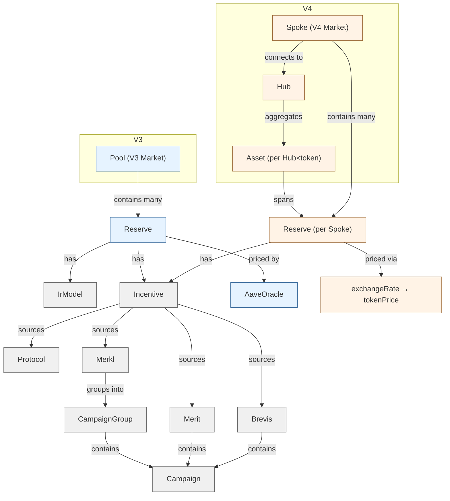

# Aave Protocol Analysis — Domain Language

Aave V3/V4 协议分析项目的领域术语表。建立精确的共享语言，消除 V3/V4 跨版本概念歧义。

## Language

### 实体

**Market**:
Aave 协议的逻辑部署单元，由 `(chainId, marketName)` 标识。V3 中等价于 **Pool**，V4 中等价于 **Spoke**。每个 **Market** 包含多个 **Reserve**。
_Avoid_: pool（仅 V3 语义）

**Pool**:
V3 的实现概念（Pool.sol）。V4 中不存在；V4 使用 **Hub** + **Spoke** 架构替代。
_Avoid_: market（Market 是逻辑概念，Pool 是 V3 实现概念）

**Hub**:
V4 的跨链聚合层。无 chainId，不部署在具体链上。每个 Hub 聚合多个 **Spoke** 上的 **Asset**，统一管理利率、流动性、deficit。不是 **Market**。
_Avoid_: pool（与 V3 Pool 混淆）

**Spoke**:
V4 的 per-chain 部署单元，等价于 **Market**。连接到一个或多个 **Hub**。
_Avoid_: market（Spoke 是 V4 实现概念，Market 是逻辑概念）

**Asset** (V4):
Hub 端的资产概念。由 `(Hub, underlyingToken)` 唯一标识，跨链聚合多个 **Spoke** 上的 **Reserve**。V3 无对应概念。
_Avoid_: reserve（Reserve 是 per-Market 的，Asset 是 per-Hub 的）

**Reserve**:
Market 内单个 underlying token 的借贷状态单元。V3: per-Pool per-token；V4: per-Spoke per-token per-Hub。每个 **Reserve** 可关联多个 **Incentive**。
_Avoid_: asset（V4 中 Asset 是 Hub 层概念，Reserve 是 Spoke 层概念）

### 标识

**reserveId**:
项目定义的全局复合键（string），唯一标识一个 **Reserve**。V3 格式 `{chainId}:{poolAddress}:{tokenAddress}`（3段），V4 格式 `{chainId}:{spokeAddress}:{tokenAddress}:{hubAddress}`（4段，hubAddress 确保同一 Spoke 同一 token 不同 Hub 时唯一，且与 onchainKey 天然一致无需映射）。与合约原生的 reserveId（per-Spoke uint256 自增局部 ID）不同；合约原生 ID 在本项目中不使用。
_Avoid_: assetId（V4 合约层概念，per-Hub 局部 ID）

**assetId** (V4):
合约层 Hub 内部的 uint256 自增 ID，per-Hub 唯一。同一 underlying token 在不同 Hub 中 assetId 不同。本项目中不直接使用，仅链上 ABI 引用。
_Avoid_: reserveId

**hubId** / **spokeId**:
Hub/Spoke 的 SDK 内部 ID。仅供 SDK 内部使用，不在本项目运行时关键路径上。
_Avoid_: 无

**spokeKey**:
Spoke 的功能性复合标识，格式 `chainId:spokeAddress`（如 `1:0x94e7a5dcbe81...`）。用于 DB 查找、configMap key 等需要唯一性的场景。取代旧 address-book raw key（如 `MAIN_SPOKE`）。
_Avoid_: spokeName（展示用，非唯一）

**spokeName**:
Spoke 的人类可读短名（如 `"Main"`、`"Bluechip"`），来源 SDK `spoke.name`。用于日志、API 展示等非唯一性场景。取代旧 address-book raw key 兼做标识+展示的双重角色。
_Avoid_: spokeKey（标识用，非展示）

**hubName**:
Hub 的人类可读短名（如 `"Core"`、`"Prime"`），来源 SDK `hub.name`。用于前端显示。
_Avoid_: hubKey

### 利率

**supplyApy**:
供应年化收益率（APY，复利）。V3 来源 Aave SDK `supplyInfo.apy`；V4 来源 SDK `summary.supplyApy`。
_Avoid_: supplyApr, supplyRate

**borrowApy**:
借贷年化利率（APY，复利）。V3 来源 Aave SDK `borrowInfo.apy`；V4 来源 SDK `summary.borrowApy`。
_Avoid_: borrowApr, variableBorrowRate

**IrModel** (利率模型):
定义 borrowApy 随 utilizationPct 变化的分段线性函数。包含四个参数：
- **baseBorrowRate** — utilization = 0 时的基础借贷利率
- **slopeBelowOptimal** — 最优利用率以下的斜率
- **slopeAboveOptimal** — 最优利用率以上的斜率
- **optimalUtilization** — 斜率拐点（最优利用率）

V3 来源 Pool 合约 `interestRateModel`；V4 来源 Hub 合约 `getAsset` 返回值。
_Avoid_: interestRateModel（合约名，与领域概念混淆）

**utilizationPct**:
利用率 = borrowed / (supplied + borrowed)，百分比形式。驱动 IrModel 的输入。
_Avoid_: utilizationRate, utilization

**protocolFee**:
协议从借贷利差中抽取的费率。V3 由 PoolAdmin 配置；V4 由 Hub 管理。
_Avoid_: fee

### 状态

**isFrozen**:
V3: Pool 级别冻结标志，禁止供应和借贷。V4: Spoke 级别冻结标志。独立位图位，不蕴含其他标志。
_Avoid_: frozen

**isPaused**:
V3: Pool 级别暂停标志，禁止供应和借贷。V4: Spoke 级别暂停标志。独立位图位，不蕴含其他标志。
_Avoid_: paused

**isActive**:
Reserve 是否已激活。`isActive = false` 即 **isInactive**，该 Reserve 不可用。
_Avoid_: active

**isInactive**:
`isActive === false` 的等价表达。V4 额外从 Hub 的 `Asset.status.active` 获取。
_Avoid_: inactive

**isDeprecated** (V4):
V4 Spoke 独有标志，标记 Reserve 已废弃。V3 无此标志。

**isEmergency** (V4):
V4 Hub 独有标志，标记 Asset 进入紧急状态。V3 无此标志。

**supplyDisabled** / **borrowDisabled**:
综合推导标志。V3: 由 `isFrozen || isPaused || !isActive` 推导；V4: 由 Spoke 级标志 + Hub 级标志 + `canSupply`/`canBorrow` 联合推导。**不是任何单一标志的派生**，是多项条件的合取结果。
_Avoid_: cannotSupply, cannotBorrow

### 规模

**supplied**:
当前总供应量（string，大数）。V3: `totalDeposits`；V4: Hub 聚合的 `addedAssets`。
_Avoid_: totalDeposits, totalSupply

**borrowed**:
当前总借贷量（string，大数）。V3: `totalVariableDebt`（本项目只关注 variable rate）；V4: Hub 聚合的 `drawnShares × drawnIndex`。
_Avoid_: totalVariableDebt, totalDebt

**liquidity**:
可用流动性 = supplied - borrowed（string，大数）。
_Avoid_: availableLiquidity

**supplyCap** / **borrowCap**:
供应/借贷上限（string，大数）。由治理配置。
_Avoid_: depositCap, debtCeiling

**deficit**:
清算资不抵债时产生的缺口（string，大数，ray 单位）。V3: per-Reserve 的 `deficit`；V4: per-Asset 的 `deficitRay`（Hub 层聚合，跨 Spoke 共享）。语义统一，存储粒度不同。
_Avoid_: badDebt

### 激励

**Incentive**:
对 **Reserve** 上供应或借贷行为的年化奖励，以 APR 表达。四源：Protocol / Merit / Merkl / Brevis。
_Avoid_: reward, emission

**Campaign**:
最小激励单元，由单一源（Merit/Merkl/Brevis）发放，包含 APR 值、目标条件、有效期。多个 Campaign 可归入同一 **CampaignGroup**。
_Avoid_: campaignBreakdown（已归并）

**Campaign Hash ID** (campaignId):
Campaign 的全局唯一标识符，格式为 64 位 hex 哈希（如 `0x0cf07a3891...`）。在 Merkl API 响应中由 `campaign.campaignId` 字段提供，用作 breakdown 的主键、Map key、Merkl Web UI URL 路径段。R1 迁移后统一使用 Hash ID，不再暴露 DB ID。
_Avoid_: campaignDatabaseId, dbId（已从 API 移除）

**Campaign Database ID** (campaign.id):
Merkl API 原始响应中 `campaign.id` 字段，数字型自增 ID，per-opportunity 局部唯一。仅在 fetcher 内部用于 Merit 动态信息查找（构建 Merit 页面 URL），不输出到 API。与 **Campaign Hash ID** 不同。
_Avoid_: campaignId（Campaign Hash ID 才是 campaignId）

**lastEndedCampaign**:
嵌入在 live Campaign 上的嵌套对象，记录同 `rewardTokenSymbol` 的最近已结束 campaign 信息。仅存在于 `MerklCampaignBreakdown`。包含 `startedAt`/`endedAt`/`campaignId` 三个字段。每个 live breakdown 最多嵌入一个（7 天 lookback 窗口内最近结束的）。ended campaign 不再作为独立 stub breakdown 出现在 `breakdowns` 数组中。
_Avoid_: recentlyEnded（旧命名，已废弃）, stubBreakdown（旧模式，已移除）

**CampaignGroup**:
按逻辑分组的一组 **Campaign** 容器。例如 Merkl 中同一 opportunity 下的多个 Campaign。每个 CampaignGroup 通过 **protocolVersion** (`'v3'` | `'v4'`) 绑定到对应协议版本的 Reserve，确保 V3/V4 激励来源不会交叉污染。Merit 和 Brevis 目前仅服务于 V3。
_Avoid_: opportunity（Merkl 术语，与通用概念混淆）

**protocolVersion**:
CampaignGroup 的协议版本标签 (`'v3'` | `'v4'`)。Merkl 的 protocolVersion 通过 4-step 优先级推导（ADR-0018）：1) type 前缀 `AAVE_V4_` → `v4`；2) explorerAddress 反查无歧义地址(aToken/vToken/spoke) → 对应版本；3) explorerAddress 匹配 V4 underlying token → `v4`；4) 默认 → `v3`。Merit 和 Brevis 暂固定为 `v3`。
_Avoid_: version, networkVersion

**meritSupplys** / **meritBorrows**:
Merit（社区贡献证明）激励，per-Campaign APR 数组。每条包含 apr、selfApr、link、startDate、endDate 等。仅服务于 V3。
_Avoid_: meritSupplyIncentives, meritBorrowIncentives

**merklSupplys** / **merklBorrows** / **merklHolds**:
Merkl 激励，按 CampaignGroup 组织的 per-Campaign APR 数组。每个 CampaignGroup 包含 link + breakdowns（含 campaignApr、campaignId、campaignType 等）。支持 V3/V4，protocolVersion 由 4-step 优先级推导 (ADR-0018)。
_Avoid_: merklSupplyIncentives, merklBorrowIncentives

**brevisSupplys** / **brevisBorrows**:
Brevis（证明系统）激励，按 CampaignGroup 组织的 per-Campaign APR 数组。目前仅服务于 V3。
_Avoid_: brevisSupplyIncentives, brevisBorrowIncentives

**borrowBlacklist**:
Merkl CampaignGroup 级约束标志。当 `borrowBlacklist=true` 时，用户有 borrow position → 该 supply incentive 归零（二元排除）。由 Merkl opportunity 的 `identifier` 字段包含 `BORROW_BL` 后缀时触发。与 **netPositionConstraint**（按比例抵消）语义不同，不复用同一字段。
_Avoid_: borrowBl, blConstraint

**offsetLevel**:
Net position constraint 的 offset 匹配范围，由 opportunityType 决定性映射（无运行时推导，无 fallback）。`'reserve'` = 精确匹配（V3 同 pool、V4 SPOKE_SUPPLY 同 reserve）；`'hub-cross-spoke'` = 匹配同 hub 同 token 下所有 spoke（V4 HUB_SUPPLY、AAVE_V4_NET_APR，因缺少 spokeAddress）。
_Avoid_: spoke-cross-hub, cross-market（已移除的死路径）

### 价格

**tokenPrice**:
underlying token 的 USD 价格。V3 来源 **AaveOracle**（链上预言机 → SDK）；V4 来源 SDK 的 `exchangeRate`（份额兑换率的近似值）。激励 reward token 价格缺失时走 **CoinGecko** fallback。
_Avoid_: price, oraclePrice

**AaveOracle**:
V3 链上价格预言机合约。为每个 Reserve 的 underlying token 提供链上价格。本项目中由 SDK 内部调用，代码不直接触及。
_Avoid_: priceOracle

**CoinGecko**:
外部价格 API，作为 reward token 价格的 fallback 来源。通过 `token-price-resolver.ts` + `coingecko-platform-by-chain-id.ts` 调用。
_Avoid_: coingeckoApi

### 会计

**liquidityIndex** (V3):
V3 供应累计乘数（ray 单位）。`balance = scaledBalance × liquidityIndex`，从归一化余额还原到实际余额的缩放因子。V4 中不存在，被 shares-based accounting 替代。本项目中不使用。
_Avoid_: supplyIndex, index

**exchangeRate** (V4):
V4 份额兑换率（ray 单位）。`addedAssets = addedShares × exchangeRate`，一份 addedShare 对应多少 underlying asset。V3 中不存在。本项目中仅用作 tokenPrice 的取值路径，不作为独立业务字段输出。
_Avoid_: sharePrice（与 ERC4626 混淆但不等价）

### 数据架构

**Snapshot**:
某时刻的数据快照。由 cron 定时写入内存，API 只读。包含 fetchedAt 时间戳和 payload。
_Avoid_: cache, state

**freshness** / **cacheTtl**:
数据新鲜度语义。hardTtl 为安全阈值（超时返回 503），softTtl 为缓存有效窗口。不同数据源有独立 TTL：markets 1min，onchain 30min，forecast 15min。
_Avoid_: expiry, timeout

**OnchainData**:
直接从链上合约读取的数据（deficit、利率模型参数），区别于 SDK 聚合数据。由独立 cron 刷新，per-Pool 缓存。
_Avoid_: chainData, contractData

**fetchResult** (envelope):
`MarketsPayload._metadata.fetchResult.{v3,v4}` 的 per-side fetch 结果信封，含 `{ success: boolean, source: 'sdk' | 'rpc' | 'stale' | 'none' }`。Fetcher 写入（`'sdk'`/`'rpc'`/`'none'`），backend 读取并在 stale merge 后通过 `correctFetchResult()` 修正（可覆写为 `'stale'`）。是 fetcher → backend 的稳定契约，修正后也是 backend → API 消费者的稳定契约。取代早期扁平的 `_v3Succeeded` / `_v4Succeeded` 下划线字段。详见 ADR-0022。
_Avoid_: \_v3Succeeded, \_v4Succeeded（已被结构化字段取代）

**fallbackSource**:
Reserve 数据兜底来源分类。优先级 `sdk > rpc > stale > none`：SDK 主路径失败时依次降级。
- `sdk`：Aave SDK 聚合数据（正常路径）
- `rpc`：fetcher 包内 inline 直读 Hub+Spoke（V4 SDK 空集时触发，详见 ADR-0021）
- `stale`：backend 层 per-side staleData（RPC 也失败时兜底，详见 ADR-0020）
- `none`：所有兜底均失败，该 side 数据为空

**staleData** (per-side):
backend 在 `marketsService.ts` 维护的 V3/V4 各自独立的上次成功 fetch 数据。`v3FetchedAt`/`v4FetchedAt` 独立时间戳，受 `marketsHardTtlMs` 限制；过期后该 side 直接为空（merged dataset 中该 side 缺位，不影响另一 side）。是三层兜底中的 last resort。详见 ADR-0020。
_Avoid_: cache（与 OnchainData cache 混淆），fallbackSnapshot（snapshot 是合并后的产物，不是 per-side）

---

## Flagged Ambiguities

| 术语 | 歧义源 | 本项目约定 |
|------|--------|-----------|
| Pool | V3 实现概念 vs 通用"资金池" | 仅指 V3 Pool.sol，V4 用 Hub/Spoke |
| Market | 逻辑概念 vs V3 Pool vs V4 Spoke | 逻辑部署单元，V3=Pool, V4=Spoke |
| Reserve | per-Market 资产状态 vs V4 Asset | per-Market per-token 的借贷状态单元 |
| reserveId | 合约 uint256 局部 ID vs 项目 string 全局复合键 | 项目全局复合键 |
| exchangeRate | V4 份额兑换率 vs V3 liquidityIndex vs tokenPrice | V4 份额兑换率，仅用作 tokenPrice 来源 |

---

## Relationships

---

## Example Dialogue

> **Dev**: 这个 Reserve 的 isFrozen 是 true，供应还能用吗？
>
> **Domain Expert**: isFrozen 为 true 时，协议层禁止供应和借贷。但 `supplyDisabled` 是综合推导标志——V3 中 `isFrozen || isPaused || !isActive` 任一为 true 就 disabled；V4 中还需要检查 Hub 级标志和 `canSupply`。
>
> **Dev**: V4 的 Hub 也冻结了怎么办？
>
> **Domain Expert**: V4 有两层标志：Spoke 层（isFrozen/isPaused/isInactive）和 Hub 层（isEmergency/isDeprecated）。两层完全解耦，没有自动级联。所以 Spoke 未冻结但 Hub isEmergency 时，`supplyDisabled` 推导仍可能为 true。
>
> **Dev**: exchangeRate 和 tokenPrice 是一回事吗？
>
> **Domain Expert**: 不是。exchangeRate 是 V4 份额兑换率（shares-based accounting 的核心概念），tokenPrice 是 underlying 的 USD 价格。只是在本项目中，V4 用 exchangeRate 近似作为 tokenPrice 的值来源，这是实现层面的简化，不是语义等价。
