# Aave 市场数据获取系统 - 模块架构图

## 整体流程图

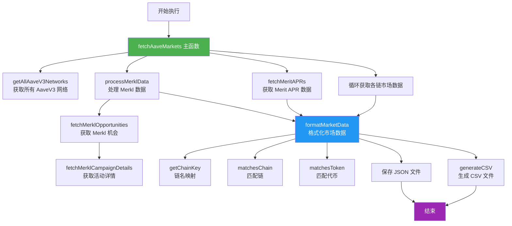

## 模块分类详解

### 1️⃣ 核心主函数模块

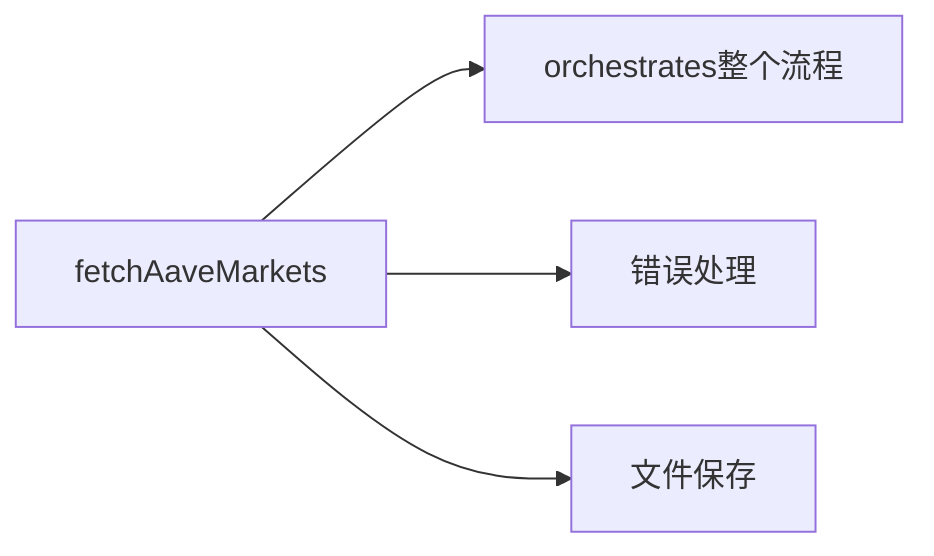

**职责**：
- 协调所有子模块
- 处理全局错误
- 保存最终数据到文件

---

### 2️⃣ 数据获取模块 (Data Fetchers)

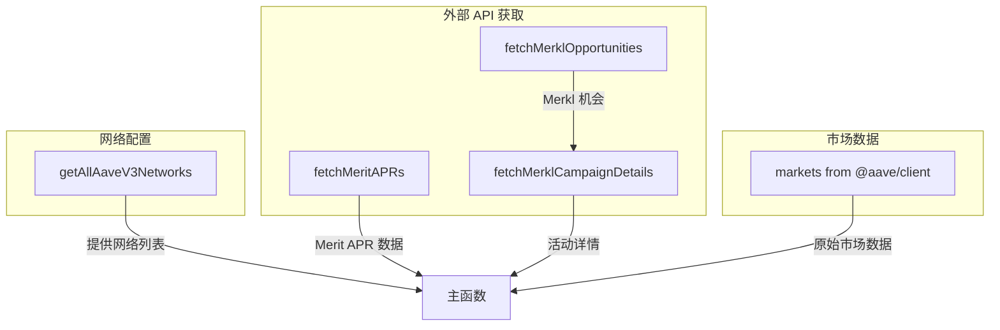

**各函数职责**：

| 函数 | 数据源 | 返回值 | 用途 |
|------|--------|--------|------|
| `getAllAaveV3Networks()` | @bgd-labs/aave-address-book | `NetworkInfo[]` | 获取所有支持的网络配置 |
| `fetchMeritAPRs()` | https://apps.aavechan.com/api/merit/aprs | `Record<string, number>` | 获取激励 APR 数据 |
| `fetchMerklOpportunities()` | https://api.merkl.xyz/v4/opportunities | `MerklOpportunity[]` | 获取 Merkl 机会列表 |
| `fetchMerklCampaignDetails()` | https://api.merkl.xyz/v4/campaigns/{id} | `MerklCampaignDetails` | 获取单个活动详情 |

---

### 3️⃣ 数据处理模块 (Data Processors)

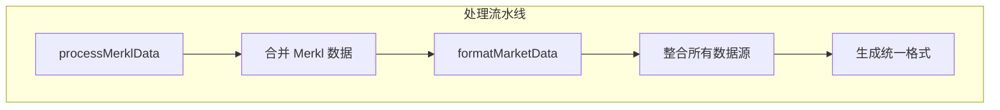

**processMerklData 流程**：
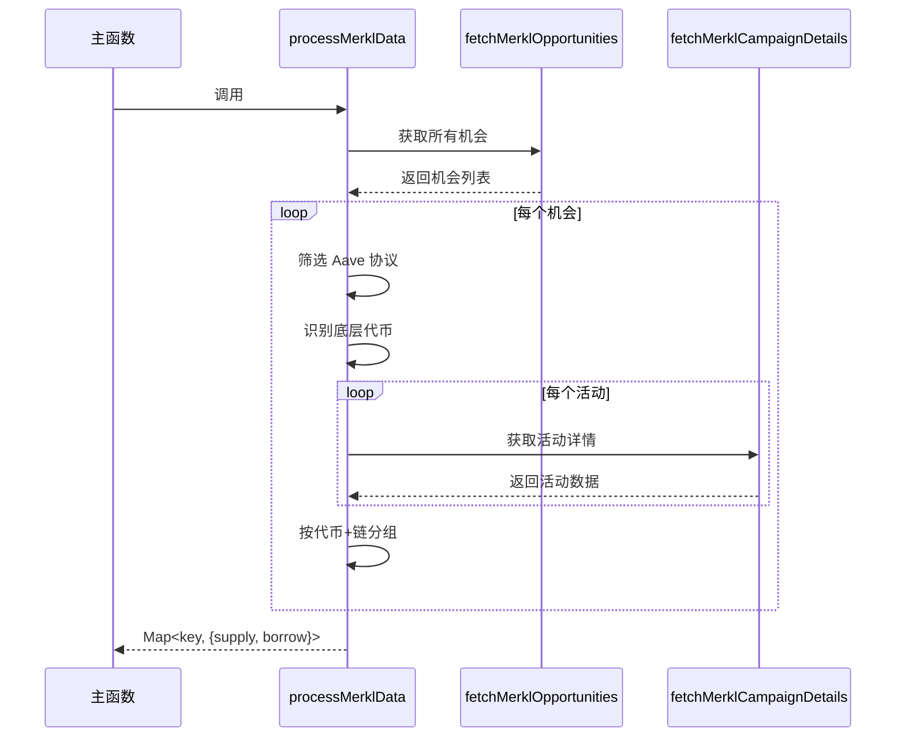

**formatMarketData 流程**：
```mermaid
graph LR
    A[原始市场数据] --> B[遍历每个市场]
    B --> C[遍历每个储备资产]
    C --> D{匹配激励数据}
    
    D --> D1[Merit APR]
    D --> D2[Merkl APR]
    
    D1 --> E[getChainKey]
    D1 --> F[matchesChain]
    D1 --> G[matchesToken]
    
    D2 --> H[查找 Merkl Map]
    
    E --> I[组装格式化数据]
    F --> I
    G --> I
    H --> I
    
    I --> J[FormattedReserveData[]]
```

---

### 4️⃣ 工具函数模块 (Utilities)

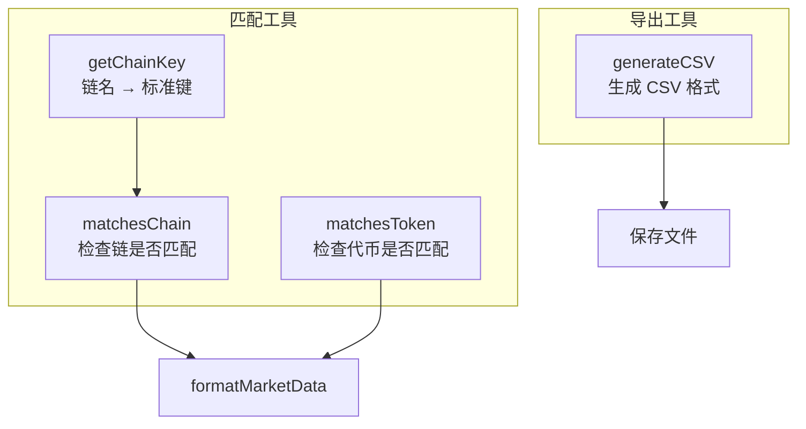

**工具函数细节**：

1. **getChainKey(chainName)**: 
   - 输入：显示名称 (如 "Ethereum")
   - 输出：标准化键 (如 "ethereum")
   - 用途：统一链名称格式

2. **matchesChain(parts, chainKey)**:
   - 检查 Merit APR key 中的链是否匹配
   - 处理 `self-` 前缀情况

3. **matchesToken(parts, tokenSymbol)**:
   - 智能匹配代币符号
   - 处理变体 (如 USDT/USD₮, USDC/USDCe)
   - 使用映射表进行模糊匹配

4. **generateCSV(data)**:
   - 转换 JSON 为 CSV 格式
   - 处理数组字段
   - 添加适当的引号和转义

---

### 5️⃣ 数据流向图

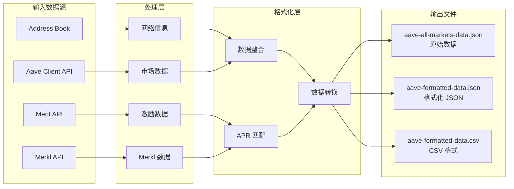

---

## 数据类型接口关系

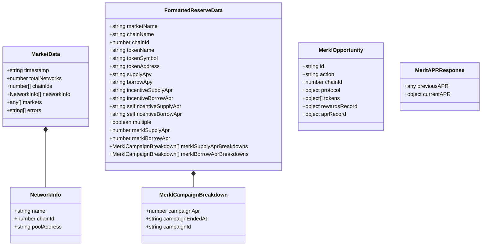

---

## 函数调用层次结构

```
fetchAaveMarkets() [主函数]
├── getAllAaveV3Networks()
│   └── 读取 @bgd-labs/aave-address-book
│
├── fetchMeritAPRs()
│   └── HTTP GET: apps.aavechan.com/api/merit/aprs
│
├── processMerklData()
│   ├── fetchMerklOpportunities()
│   │   └── HTTP GET: api.merkl.xyz/v4/opportunities
│   └── fetchMerklCampaignDetails(campaignId)
│       └── HTTP GET: api.merkl.xyz/v4/campaigns/{id}
│
├── markets() [from @aave/client]
│   └── 循环调用每个 chainId
│
├── formatMarketData(markets, meritAPRs, merklData)
│   ├── 遍历每个 market
│   ├── 遍历每个 reserve
│   ├── getChainKey(chainName)
│   ├── matchesChain(parts, chainKey)
│   ├── matchesToken(parts, tokenSymbol)
│   └── 组装 FormattedReserveData
│
├── generateCSV(formattedData)
│   └── 转换为 CSV 字符串
│
└── writeFile() [多次调用]
    ├── aave-all-markets-data.json
    ├── aave-formatted-data.json
    └── aave-formatted-data.csv
```

---

## 关键数据处理逻辑

### 激励 APR 匹配算法

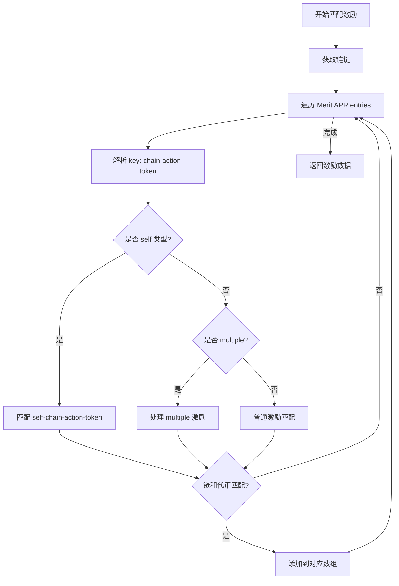

### Merkl 数据聚合

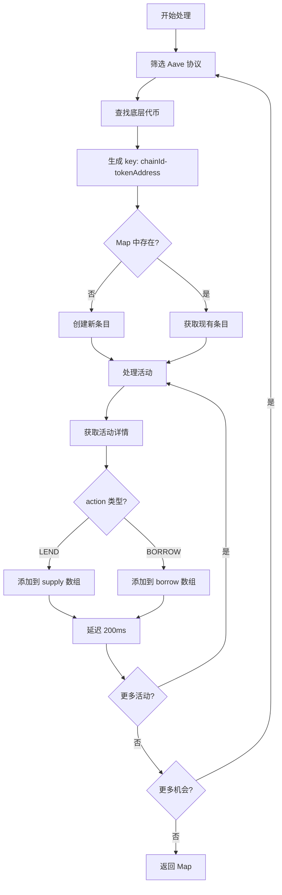

---

## 外部依赖

```mermaid
graph TB
    subgraph External["外部包依赖"]
        A1[@aave/client]
        A2[@bgd-labs/aave-address-book]
        A3[node-fetch]
        A4[fs/promises]
    end
    
    subgraph APIs["外部 API"]
        B1[apps.aavechan.com - Merit APR]
        B2[api.merkl.xyz - Merkl 数据]
    end
    
    A1 --> |市场数据| App[应用程序]
    A2 --> |网络配置| App
    A3 --> |HTTP 请求| B1
    A3 --> |HTTP 请求| B2
    A4 --> |文件写入| Files[输出文件]
```

---

## 错误处理策略

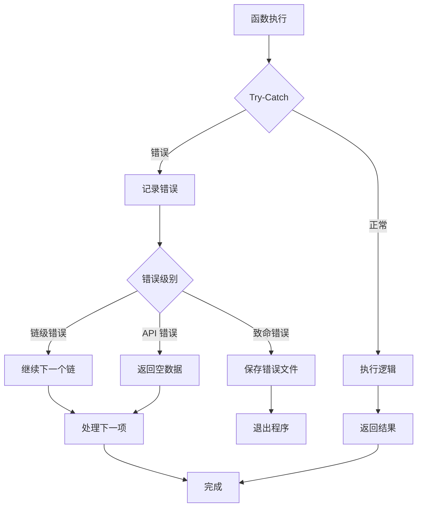

---

## 性能优化点

1. **并发控制**: Merkl API 调用间有 200ms 延迟避免限流
2. **去重处理**: chainId 数组去重减少重复请求
3. **错误隔离**: 单个链失败不影响其他链的数据获取
4. **数据缓存**: Merit 和 Merkl 数据只获取一次，供所有市场使用

---

## 使用示例

```bash
# 运行主程序
npm start

# 输出文件：
# - aave-all-markets-data.json      # 原始市场数据
# - aave-formatted-data.json        # 格式化 JSON
# - aave-formatted-data.csv         # CSV 格式
```

---

## 总结

这个系统的核心设计理念：

1. **模块化**: 清晰的职责分离
2. **可扩展**: 易于添加新的数据源
3. **容错性**: 完善的错误处理
4. **数据整合**: 多源数据统一格式化
5. **用户友好**: 提供 JSON 和 CSV 双格式输出

主要数据流：**获取 → 处理 → 整合 → 格式化 → 输出**

