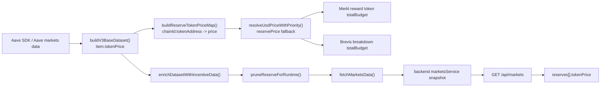

# API 接口文档

## 概述

本文档描述了 Aave 市场数据服务的 API 接口和数据格式。服务提供 Aave V3 协议的市场数据，包括基础 APY、协议激励、Merit APR、Merkl APR 和 Brevis APR 等激励信息。

**相关**：Brevis Incentra 非核心参考（已删 client API、type/status 全表、REST 补证）见 [brevis-supplement.md](./brevis-supplement.md)。

**收益率字段口径（重要）**：

- **`GET /api/markets` 的 JSON 响应**：`supplyApy`、`borrowApy`、协议激励数组、Merit / Merkl / Brevis 等与收益率相关的数字均为 **百分数**（例如 `5.2` 表示 5.2%/年），由服务端在响应序列化时从内存中的 **年化比例（ratio）** 乘以 100 得到。
- **服务端内存快照、cron 合并路径、root fetcher 写入的 `data/runtime/*.json`（及同结构的中间数据）**：上述字段为 **比例**（例如 `0.052` = 5.2%/年）。依赖磁盘文件或内存结构的脚本/集成须按 ratio 读取，勿与 HTTP 响应混用。

下文「数据模型」中的百分比说明 **指 `GET /api/markets` 对外 JSON**，除非另行注明。

## 基础信息

- **服务地址**: `http://localhost:3001` (开发环境)
- **API 基础路径**:
  - `/api/markets` - 市场数据（含 on-chain 字段）
  - `/api/meta/side-data` - 侧数据聚合（categories + fdv + forecast）
  - `/health`、`/api/health` - 健康检查
- **数据格式**: JSON
- **字符编码**: UTF-8
- **端点总数**: **4 条 URL**（若将 `GET /health` 与 `GET /api/health` 视为同一逻辑则共 3 个逻辑端点）

## Rate Limiting & Security

| 端点                          | 速率限制            | 认证                          | Body 限制       |
| ----------------------------- | ------------------- | ----------------------------- | --------------- |
| `GET /api/markets`            | 120 req/min per IP  | 无（公开）                    | N/A (GET)       |
| `GET /api/meta/side-data`     | 120 req/min per IP  | 无（公开）                    | N/A (GET)       |
| `GET /health`, `/api/health`  | 无                  | 无（公开）                    | N/A (GET)       |
| `GET /api/seo/*`              | 无                  | `X-Admin-Token` (timing-safe) | N/A (GET)       |
| `POST /api/seo/semrush`       | 无                  | `X-Admin-Token`               | 256 KB          |
| `POST /api/seo/semrush/batch` | 5 req/min per token | `X-Admin-Token`               | 5 MB (≤5000 条) |
| `DELETE /api/seo/semrush/:id` | 无                  | `X-Admin-Token`               | N/A             |
| `POST /api/seo/gsc/trigger`   | 无                  | `X-Admin-Token`               | N/A             |
| `GET /api/seo/gsc/sites`      | 无                  | `X-Admin-Token`               | N/A (GET)       |

### 503 Service Unavailable

`GET /api/markets` 在以下情况返回 503，附带 `Retry-After` 响应头（RFC 7231）：

| 场景               | errorCode                    | Retry-After | 含义                          |
| ------------------ | ---------------------------- | ----------- | ----------------------------- |
| 启动 warmup 未完成 | `MARKETS_SNAPSHOT_NOT_READY` | 10 秒       | 数据正在加载，稍后重试        |
| 数据超过 hardTTL   | `MARKETS_SNAPSHOT_STALE`     | 60 秒       | cron 持续刷新失败，等待下一轮 |

## Freshness Contract

API 文档中的 `staleTimeMs` 统一表示对外的 `softTTL`，即"建议刷新提示"而非最终服务边界。真正的 `hardTTL` 由后端 freshness 文档定义；当接口需要硬边界或 fallback 策略时，以后端实现和 `docs/backend/data-freshness-mechanism.md` 为准。

| Endpoint                        | `staleTimeMs` 语义  | 备注                                                         |
| ------------------------------- | ------------------- | ------------------------------------------------------------ |
| `GET /api/markets`              | snapshot 软过期提示 | 请求不触发刷新，硬边界由后端 markets 服务控制                |
| `GET /api/meta/side-data`       | 各子块的 softTTL    | `categories` / `fdv` / `forecast` 各自保留独立 `staleTimeMs` |
| 其他带 `staleTimeMs` 的缓存字段 | 子快照 softTTL      | 仅表示刷新节奏，不代表一定会强制失败                         |

## 数据模型

### RuntimeReserveData

市场储备数据的完整结构，包含所有激励信息。

> **前端字段映射**：各字段在前端界面中的展示名称、排序选项、派生计算公式见 [field-glossary.md](./field-glossary.md)。

```typescript
interface RuntimeReserveData {
  // 基础信息
  reserveId: string; // 储备 ID（唯一标识符）
  marketName: string; // 市场名称，如 "AaveV3Arbitrum"
  chainName: string; // 链名称，如 "Arbitrum"
  chainId: number; // 链 ID，如 42161
  tokenName: string; // 代币名称，如 "Aave Token"
  tokenSymbol: string; // 代币符号，如 "AAVE"
  tokenAddress: string; // 底层代币地址
  aTokenAddress: string | null; // aToken 地址
  vTokenAddress: string | null; // variableDebtToken 地址
  aaveProReserveId?: string; // 【仅 V4】V4 SDK ReserveId（base64），用于拼接 pro.aave.com 深链

  // 【仅 V4】Hub & Spoke 地址信息（用于合约交互和 pro.aave.com 链接）
  hubId?: string; // 【仅 V4】Hub 唯一标识符（base64）
  hubName?: string; // 【仅 V4】Hub 名称，如 "Core"
  hubAddress?: string; // 【仅 V4】Hub 合约地址
  spokeId?: string; // 【仅 V4】Spoke 唯一标识符（base64）
  spokeName?: string; // 【仅 V4】Spoke 名称，如 "Main"
  spokeAddress?: string; // 【仅 V4】Spoke 合约地址（市场入口）

  // 【仅 V4】字段层级语义（Hub & Spoke 架构）
  // V4 的 Hub & Spoke 架构中，部分字段为 Hub 级别（同一 Hub+token 的所有 Spoke 共享），
  // 部分为 Per-Spoke 级别（每个 Spoke 独立）。具体分类：
  //   Hub 级别：liquidity、utilizationPct、利率模型参数（protocolFee、slopeBelowOptimal 等）
  //   Per-Spoke 级别：supplied、borrowed、supplyCap、borrowCap、reserveSizeUsd
  // 前端通过 hubAggregation.ts 按 hubId:tokenAddress 分组，求和各 Spoke 生成 Hub 级别
  // 聚合值，用于 TotalBorrowedUsd / AvailableLiquidityUsd 等展示计算。

  // 价格与规模（单位已说明）
  tokenPrice?: number; // 【单位: USD】每个 token 的美元价格
  reserveSizeUsd?: number; // 【单位: USD】市场总供应量（TVL = total supply），美元计价（V4：Per-Spoke 级别）
  utilizationPct?: number; // 【单位: 百分比 0-100】资金利用率，如 45.5 表示 45.5%（V4：Hub 级别）

  // 基础 APY 与禁用状态（单位: 百分比）
  supplyApy?: number; // 【单位: 百分比】Supply APY，如 2.07 表示 2.07%
  supplyDisabled?: boolean; // 供应是否被禁用（仅当 true 时出现），原因：isFrozen、isPaused 或 supplyCap=1
  supplyCapUsd?: number; // 【单位: USD】供应上限金额
  borrowApy?: number; // 【单位: 百分比】Borrow APY，如 3.97 表示 3.97%（即使禁用也返回真实值）
  borrowDisabled?: boolean; // 借贷是否被禁用（仅当 true 时出现），原因：borrowingState=DISABLED 或 borrowCap=1
  borrowCapUsd?: number; // 【单位: USD】借贷上限金额，与 supplyCapUsd 对称

  // 协议激励（来自 Aave 协议，单位: 百分比）
  supplyIncentives?: number[]; // 【单位: 百分比数组】Protocol supply incentives
  borrowIncentives?: number[]; // 【单位: 百分比数组】Protocol borrow incentives

  // Merit APR 激励（可选字段，仅在存在数据时出现）
  meritSupplys?: Array<{
    apr: number; // APR 百分比值（如 5.2 表示 5.2%）
    selfApr?: number; // Self APR 百分比值（如果有对应的 self- 前缀的 key）
    link: string; // Merit 活动详情页链接
    startDate: string; // 活动开始日期
    endDate: string; // 活动结束日期
    startBlock?: string; // 活动开始区块（可选）
    endBlock?: string; // 活动结束区块（可选）
    requiredBorrowTokens?: string[]; // 需要 borrow 的 token 列表（用于 supply with borrow requirement），'multiple' 表示任意 token
  }>;
  meritBorrows?: Array<{
    apr: number; // APR 百分比值（如 5.2 表示 5.2%）
    selfApr?: number; // Self APR 百分比值（如果有对应的 self- 前缀的 key）
    link: string; // Merit 活动详情页链接
    startDate: string; // 活动开始日期
    endDate: string; // 活动结束日期
    startBlock?: string; // 活动开始区块（可选）
    endBlock?: string; // 活动结束区块（可选）
    requiredSupplyTokens?: string[]; // 需要 supply 的 token 列表（用于 borrow with supply requirement），'multiple' 表示任意 token
  }>;

  // Merkl 详细机会数据（可选字段，仅在存在数据时出现）
  merklSupplys?: MerklOpportunityGroup[];
  merklBorrows?: MerklOpportunityGroup[];
  merklHolds?: MerklOpportunityGroup[];

  // Brevis APR 激励（可选字段，仅在存在数据时出现）
  brevisSupplys?: Array<{
    link: string; // Brevis 活动详情页链接
    campaignApr: number; // Canonical APR（百分比数值）
    campaignStartedAt: string; // Canonical 开始时间（ISO 8601）
    campaignEndedAt: string; // Canonical 结束时间（ISO 8601）
    message?: string; // 活动说明文案
    latestTvl?: number; // 活动 TVL（USD）
    totalBudget?: number; // 活动总预算（USD）
    perUserRewardCapUsd?: number; // 每用户奖励上限（USD，当前主要针对 MetaMask campaign）
    campaignId?: string; // supply/borrow 两侧同 ID 代表同一个 Brevis campaign
  }>;
  brevisBorrows?: Array<{
    link: string; // Brevis 活动详情页链接
    campaignApr: number; // Canonical APR（百分比数值）
    campaignStartedAt: string; // Canonical 开始时间（ISO 8601）
    campaignEndedAt: string; // Canonical 结束时间（ISO 8601）
    message?: string; // 活动说明文案
    latestTvl?: number; // 活动 TVL（USD）
    totalBudget?: number; // 活动总预算（USD）
    perUserRewardCapUsd?: number; // 每用户奖励上限（USD，当前主要针对 MetaMask campaign）
    campaignId?: string; // supply/borrow 两侧同 ID 代表同一个 Brevis campaign
  }>;

  // On-chain & SDK fields（用于 APR 模拟计算，可选字段，扁平化到 reserve 中）
  // Raw token 金额为 BigInt-safe string；利率模型参数为 number percent（V3/V4 精度已统一）
  decimals?: number; // 代币精度，仅 ≠ 18 时出现（18 位 token 省略以节省带宽）
  liquidity?: string; // 【单位: raw token】可用流动性（V4：Hub 级别，同一 Hub+token 的所有 Spoke 共享）
  borrowed?: string; // 【单位: raw token】总借款量（V4：Per-Spoke 级别，前端按 Hub 聚合）
  supplied?: string; // 【单位: raw token】总供应量（V4：Per-Spoke 级别，前端按 Hub 聚合）
  supplyCap?: string; // 【单位: raw token】供应上限
  borrowCap?: string; // 【单位: raw token】借贷上限
  deficit?: string; // 【单位: raw token】储备赤字（坏账），用于计算准确的 Supply APY
  // 利率模型参数（已统一为 percent number，例如 9 = 9%）
  protocolFee?: number; // 【单位: percent】协议费用
  slopeBelowOptimal?: number; // 【单位: percent】利率曲线斜率 1（低于最优利用率时）
  slopeAboveOptimal?: number; // 【单位: percent】利率曲线斜率 2（高于最优利用率时）
  optimalUtilization?: number; // 【单位: percent】最优利用率（如 92 = 92%）
  baseBorrowRate?: number; // 【单位: percent】基础借款利率
}
```

### MerklOpportunityGroup

Merkl 机会分组数据，用于 JSON 输出，避免重复。Merkl `GET /v4/opportunities` 响应里哪些字段参与构建，见 `docs/merkl-merit-cache-architecture.md` 中章节 **Merkl `/v4/opportunities[]` item: which fields `merkl-api.ts` reads**（含字段表与 Mermaid 图）。

```typescript
interface MerklOpportunityGroup {
  link: string; // Opportunity 详情页链接
  name?: string; // Opportunity 名称（可选）
  message?: string; // Opportunity 消息/描述（可选）
  breakdowns: MerklCampaignBreakdown[]; // 该 opportunity 的所有 breakdowns
}

// `pointsPerThousandUsd`：仅当 breakdown 上 `reward token.type === 'PRETGE'` 时输出（见 `packages/aave-fetcher/src/merkl-api.ts`）。

interface MerklCampaignBreakdown {
  campaignApr: number; // 活动 APR（百分比数值，来自 Merkl campaign）
  campaignStartedAt: string; // 活动开始时间（ISO 8601）
  campaignEndedAt: string; // 活动结束时间（ISO 8601）
  campaignId: string; // 活动 ID
  pointsPerThousandUsd?: number; // breakdown.value / opportunity TVL × 1000（仅 PRETGE points campaign 输出）
}
```

## API 端点

### 1. 获取所有市场数据

**端点**: `GET /api/markets`

**描述**: 获取 markets 快照（`markets-v3`），返回 `snapshot + reserves`。该端点的 freshness 语义见上面的 `Freshness Contract`；这里仅描述 payload 形状。`reserves` 保留原有全量 reserve 字段（包括 `aTokenAddress`、`vTokenAddress`、各类激励字段），并新增 `tokenPrice` / `reserveSizeUsd` / `utilizationPct` 以支持前端展示。该端点遵循 cron-write/API-read-only：请求只读内存快照，不触发外部拉取；冷启动未预热完成时返回 `503`。

**请求参数**: 无

**响应格式**:

```typescript
interface MarketsResponse {
  snapshot: {
    lastUpdated: string; // 最后更新时间（ISO 8601）
    version: "markets-v3";
    staleTimeMs: number; // 对外 softTTL（见 Freshness Contract），默认 60 秒
  };
  reserves: MarketWithSpread[]; // 保留原全量字段 + 新增展示字段 + 可选 on-chain 字段
}
```

**Token 价格返回策略**：

- 每条 `reserves` 记录新增 `tokenPrice`（优先用于前端渲染，避免额外 join）
- Merkl reward token 价格当前**不在 `/api/markets` 输出**
- 若 reward token 恰好是某个 reserve 的 `aTokenAddress`，其价格按 underlying token 对待，不单独输出
- **来源字段**：`aave` 来源的价格来自 Aave markets 数据里的 `reserve.size.usdPerToken`（若缺失则回退 `reserve.usdExchangeRate`）。
- **缺省行为**：极少数 token 若本轮 Aave/Merkl 均未返回价格，则会沿用上一轮文件中该 token 的价格**仅当**上一轮文件的 `_metadata.timestamp` 在 3 倍正常更新周期内（3× backend stale 阈值，即 3 分钟）；超过则不沿用，避免长期保留已不再出现的 token 的过期价格。

**Token price 数据流图**：



要点：`/api/markets` 里的 `reserves[].tokenPrice` 来自 Aave 市场数据；`token-price-resolver.ts` 主要把这份价格当作 `reservePrice` 兜底，并把 CoinGecko 结果用于 Merkl / Brevis 的预算计算。

**市场筛选列表**：请从 `reserves` 中按 `{ marketName, chainName }` 去重推导，不要再引入额外市场列表接口。

**响应示例**:

```json
{
  "snapshot": {
    "lastUpdated": "2026-01-13T11:00:06.895Z",
    "version": "markets-v3"
  },
  "reserves": [
    {
      "reserveId": "1:0x87870bca3f3fd6335c3f4ce8392d69350b4fa4e2:0xbe9895146f7af43049ca1c1ae358b0541ea49704",
      "marketName": "AaveV3Ethereum",
      "chainName": "Ethereum",
      "chainId": 1,
      "tokenName": "Coinbase Wrapped Staked ETH",
      "tokenSymbol": "cbETH",
      "tokenAddress": "0xBe9895146f7AF43049ca1c1AE358B0541Ea49704",
      "aTokenAddress": "0x977b6fc5dE62598B08C85AC8Cf2b745874E8b78c",
      "vTokenAddress": "0x0c91bcA95b5FE69164cE583A2ec9429A569798Ed",
      "supplyApy": 0.183795381577371,
      "tokenPrice": 3942.52,
      "reserveSizeUsd": 1083255123.44,
      "utilizationPct": 61.08
    }
  ]
}
```

**状态码**:

- `200`: 成功
- `503`: 内存快照不可安全服务：
  - 冷启动未完成预热：`errorCode = "MARKETS_SNAPSHOT_NOT_READY"`
  - 快照超过硬过期上限：`errorCode = "MARKETS_SNAPSHOT_STALE"`
- `500`: 服务器错误

**注意事项**:

- 所有排序和过滤逻辑应在客户端处理
- `snapshot.staleTimeMs` 只是对外 softTTL 提示，**请求不会触发**后端重新拉取
- `tokenPrice` 已直接放在 `reserves` 行内，前端无需再做额外 price join

---

### `/api/markets` 最终字段契约（前端）

当前前端仅需依赖以下稳定字段：

- `snapshot.lastUpdated`
- `reserves[].reserveId`
- `reserves[].marketName`
- `reserves[].chainName`
- `reserves[].chainId`
- `reserves[].tokenName`
- `reserves[].tokenSymbol`
- `reserves[].tokenAddress`
- `reserves[].tokenPrice`
- `reserves[].reserveSizeUsd`
- `reserves[].utilizationPct`
- 以及原有激励字段（`supplyIncentives` / `borrowIncentives` / `merit*` / `merkl*` / `brevis*`）

不再依赖：

- 根级 `tokenPrices`
- 行内 `tokenPriceKey`

---

### 2. 获取侧数据聚合快照

**端点**: `GET /api/meta/side-data`

**描述**: 返回前端低频侧数据聚合快照，包含：

- categories：稳定币与 ETH 相关 token 分类
- fdv：FDV 数据（CoinMarketCap 优先，CoinGecko 回退）
- forecast：Merkl campaign forecast 快照

这些子数据仍由各自内部缓存和 cron 预热维护，但不再通过独立公开 endpoint 暴露；各自 `staleTimeMs` 的 freshness 语义见 `Freshness Contract`。

**请求参数**: 无

**响应特性**:

- `partial`: 某个子块失败时仍可返回部分成功结果
- `errors`: 按子块返回失败原因
- 各子块保留自己的 `fetchedAt` / `staleTimeMs`（softTTL）

**说明**:

- categories / fdv / forecast 的独立公开 URL 已移除
- 客户端若需要 campaign forecast，应从本端点的 `forecast.items` 读取，而不是请求单独 forecast route
- `GET /api/campaigns/forecast-states` 已从对外 API 中移除。
- `forecast.staleTimeMs` 对应 snapshotCache 的发布节奏，不表示每个 campaign 的 metrics 都同时刷新；campaign 级 metrics TTL 见后端 freshness 文档。

---

### 3. 健康检查

**端点**: `GET /health` / `GET /api/health`

**描述**: 返回基础运行状态与环境信息。

---

## Merkl Forecast：上游数据与派生字段

实现见 `backend/src/services/merklForecastService.ts`、`backend/src/services/merklForecastModel.ts`。以下为「Merkl / 本地快照输入」与「本服务计算」的划分；**campaign 级数据不从 Aave SDK 读取**。

### 上游（原始）数据

| 来源                                                                                                                    | 用途                                                                                                                                |
| ----------------------------------------------------------------------------------------------------------------------- | ----------------------------------------------------------------------------------------------------------------------------------- |
| **Merkl `GET /v4/campaigns/{id}`**（或 opportunities / `merkl-opportunity-meta-lite.json` 中的轻量 `campaignSnapshot`） | `amount`、`startTimestamp`、`endTimestamp`、奖励代币 `price`/`decimals`、APR 相关 `params` 等；用于预算上限、时间窗、类型与 APR cap |
| **Merkl `GET /v4/campaigns/{id}/metrics`**                                                                              | 时间序列 `tvlRecords`、`dailyRewardsRecords`（各点含 `timestamp`、`total`）                                                         |
| **`data/runtime/merkl-opportunity-meta-lite.json` 或 live `/v4/opportunities`**                                         | 每 campaign 的 `tvl`、`campaignTypeHint`（规范化后的活动类型）、以及可用的 `campaignSnapshot`（lite 新鲜时优先）                    |

### `distributionType` 与 `distributionMethod` 的对应关系

Merkl 返回里历史上存在两套命名：

- 较新的（本项目主用）：`distributionType`
- 兼容/参数侧常见：`distributionMethod`

业务含义对应如下：

| `distributionMethod`（短名） | `distributionType`（长名）             | 说明（本项目 forecast 语义）                   |
| ---------------------------- | -------------------------------------- | ---------------------------------------------- |
| `MAX_APR`                    | `MAX_REWARD_VALUE_PER_LIQUIDITY_VALUE` | 有 APR 上限；当需要追赶发放进度时仍受 cap 约束 |
| `FIX_APR`                    | `FIX_REWARD_VALUE_PER_LIQUIDITY_VALUE` | 固定 APR 速率优先；预算用尽前按目标速率发放    |
| `DUTCH_AUCTION`              | `DUTCH_AUCTION`                        | 以计划日发放为主，不走 APR cap 限速            |

字段优先级（当前实现）：

- `breakdown.distributionType`
- `breakdown.distributionMethod`
- `opportunity.distributionType`

为什么优先 `distributionType`：

- 在当前线上数据中覆盖更稳定（breakdown 级别几乎总是有 `distributionType`）。
- 可直接对接 forecast 的 canonical 三类型，减少额外短名到长名的映射分支。
- 降低因上游字段混用导致的类型识别歧义。

外部参考（Merkl 官方）：

- [Incentive Mechanisms](https://docs.merkl.xyz/merkl-mechanisms/incentive-mechanisms)
- [Distribution Types](https://docs.merkl.xyz/merkl-mechanisms/distributions)
- [Integrate Merkl API (V4)](https://docs.merkl.xyz/integrate-merkl/app)

### 派生 / 二次计算

| 项目                                                                       | 说明                                                                                                                                                                                                                                                                                                                                                                                                                                                                                                                                                                                             |
| -------------------------------------------------------------------------- | ------------------------------------------------------------------------------------------------------------------------------------------------------------------------------------------------------------------------------------------------------------------------------------------------------------------------------------------------------------------------------------------------------------------------------------------------------------------------------------------------------------------------------------------------------------------------------------------------ |
| **`totalBudget`**                                                          | `extractNormalizedTotalBudget`：`amount` 按 `decimals` 做单位换算（大整数 → 可读数量）；若存在 **`rewardToken.price` > 0** 则乘以价格得到 **USD 口径**，否则为代币数量口径。                                                                                                                                                                                                                                                                                                                                                                                                                     |
| **`distributedSoFar`**                                                     | `estimateDistributedSoFar`：仅用 **`dailyRewardsRecords`**，在 `[start, min(now,end)]` 上按阶梯速率对「日发放率」做**时间积分**；再与 `totalBudget` 取 `min`。Merkl 不直接返回该标量。**零基线策略**：当 campaign 刚启动、Merkl 尚无 `dailyRewardsRecords` 时，`distributedSoFar` 默认为 `0`（表示尚未发放），前端可拿到有意义的初始 forecast。但若持续 30 小时（`merklForecastZeroBaselineMaxAgeMs = oneDay + sixHours`）仍无 metrics 数据，该 campaign 将从 `forecast.items` 中排除并进入 `forecast.errors`，避免长期返回不可靠的初始值。一旦 Merkl 恢复正常数据，campaign 自动回到 items 中。 |
| **`latestTvl`**                                                            | 优先用 opportunities / lite 中的 **`tvl`**；否则从 **`tvlRecords`** 按时间排序取**最后一条**的 `total`。                                                                                                                                                                                                                                                                                                                                                                                                                                                                                         |
| **`aprCap`**                                                               | `extractMaxApr`：仅从 `distributionSettings.apr` 等多路径读取（年化**比例**）；不用顶层 `campaign.apr`（该字段为百分数，语义是活动 APR）。仅 `MAX_REWARD_*` / `FIX_REWARD_*` 需要。`GET /api/markets` 对客户端输出百分值（×100）。                                                                                                                                                                                                                                                                                                                                                               |
| **`plannedDaily` / `requiredDaily` / `remainingBudget` / `remainingDays`** | `buildForecastState`：`plannedDaily = totalBudget / totalDays`；`requiredDaily` 在 `DUTCH_AUCTION` 时等于 `plannedDaily`，否则为 `remainingBudget / remainingDays`；`remainingBudget = totalBudget - distributedSoFar`。                                                                                                                                                                                                                                                                                                                                                                         |
| **metrics 缓存 TTL**                                                       | **按 campaign 独立**：`metricsCache` 以 `campaignId` 为键；每个 campaign 用自己的 `dailyRewardsRecords` 时间戳间隔**中位数**作 cadence，`TTL ≈ cadence / 4` 并夹在 `[merklMetricsMin, merklMetricsMax]`（默认 **10 分钟～6 小时**）。**不同 campaign 的刷新间隔可以不同**；与业务 forecast 公式无关，仅决定何时再请求 `GET /metrics`。                                                                                                                                                                                                                                                           |

### Opportunity 元数据与 metrics 的缓存节奏

这里仅保留对外语义：campaign 级 metrics TTL 与 opportunity 元数据 TTL 属于后端 freshness contract。

### TVL 与 `distributedSoFar` 口径（摘要）

- `latestTvl`：**优先** opportunities（含 lite 索引）的 `tvl`；否则回退 metrics 的 `tvlRecords` **最新时间戳**对应的 `total`。
- **`distributedSoFar`**：**仅**来自对 `dailyRewardsRecords` 的积分估算，**不是** Merkl 某单一原始字段。

### HTTP `items[]` 实际暴露的字段

`merklForecastController.toForecastResponseItem` 只序列化：`campaignId`、`requiredDaily`、`distributedSoFar`、`endTimestamp`。

内部完整状态 `MerklForecastState` 另有 `remainingBudget`、`remainingDays`、`startTimestamp`、`asOf` 等；**当前 REST 响应未包含**这些字段。

### Merkl `MAX_REWARD_VALUE_PER_LIQUIDITY_VALUE` 下 `plannedDaily` 与 `dailyRewardsBreakdown` 一致性观察

该结论基于“市场页实际使用的 30 个 campaign”（来自后端 `GET /api/markets` 的 `merklSupplys`/`merklBorrows` 真实引用）：

- 对比口径：
  - `plannedDaily`：由 campaign `amount` 与 `[startTimestamp, endTimestamp]` 均分得出。
  - `dailyRewardsBreakdown`：`/v4/campaigns/{campaignId}` 中的 `dailyRewardsBreakdown[].value` 汇总。
  - `requiredDaily`：`/api/meta/side-data` 的 `forecast.items[]` 当前状态。
  - `campaignType`：来自 `breakdown.distributionType / breakdown.distributionMethod / opp.distributionType`（不做归一化）。

- `rawType = DUTCH_AUCTION`：在这批样本中全量一致（19/19）。
- `rawType = MAX_REWARD_VALUE_PER_LIQUIDITY_VALUE`：11 个中 5 个一致、6 个不一致。

一致（`plannedDaily ≈ dailyRewardsBreakdown`）：

- `12054222608540614766`（campaignApr 3.10 / aprCap 3.50）
- `3886370444068287679`（campaignApr 3.18 / aprCap 3.75）
- `4461587008158830948`（campaignApr 2.88 / aprCap 3.50）
- `5941889252017973095`（campaignApr 1.41 / aprCap 2.30）
- `8042494315215972422`（campaignApr 0.10 / aprCap 10.00）

不一致（`plannedDaily` 与 `dailyRewardsBreakdown` 偏差明显）：

- `1216866542342484437`（campaignApr 3.40 / aprCap 3.40）
  - `plannedDaily`≈2794.57，`requiredDaily`≈3235.88，`dailyRewardsBreakdown`≈2032.50
- `13694886148811361820`（campaignApr 3.50 / aprCap 3.50）
  - `plannedDaily`≈9570.99，`requiredDaily`≈13106.12，`dailyRewardsBreakdown`≈7974.75
- `1541246139455677822`（campaignApr 0.15 / aprCap 0.15）
  - `plannedDaily`≈465.13，`requiredDaily`≈1648.34，`dailyRewardsBreakdown`≈28.92
- `15889651832754610062`（campaignApr 3.50 / aprCap 3.50）
  - `plannedDaily`≈994.95，`requiredDaily`≈3687.86，`dailyRewardsBreakdown`=0
- `17406661278241767291`（campaignApr 3.50 / aprCap 3.50）
  - `plannedDaily`≈26427.35，`requiredDaily`≈27387.15，`dailyRewardsBreakdown`≈26039.06
- `251525480113095550`（campaignApr 1.75 / aprCap 1.75）
  - `plannedDaily`≈2672.93，`requiredDaily`≈22243.07，`dailyRewardsBreakdown`≈366.35

可见 **`MAX_REWARD_VALUE_PER_LIQUIDITY_VALUE` 且 `campaignApr` 接近/等于 `aprCap` 时**，`dailyRewardsBreakdown` 更容易与 `plannedDaily` 偏离；
且不一致样本里 `requiredDaily` 常常显著高于 `plannedDaily`，表现为“当前限速下的动态发放”。

当前实现状态与展示口径约束：

- `plannedDaily` 与 `requiredDaily` 是两个独立指标，语义不同，**禁止互相 fallback**。
- `plannedDaily`：来自 markets breakdown（`/api/markets`）里的计划日发放值。
- `requiredDaily`：来自 forecast 状态（`/api/meta/side-data` 的 `forecast.items`）里的动态目标日发放值。
- 任一字段缺失时应按“该字段不可用”处理（例如 `--`），不要用另一字段顶替。
- `dailyRewardsBreakdown` 仍保留在 debug 与 raw campaign 快照中，建议仅用于排障/分析，不作为默认展示字段。

### 3. 健康检查

**端点**: `GET /health` 或 `GET /api/health`

**描述**: 检查服务健康状态，返回服务状态和环境配置信息。两路径使用同一处理逻辑。

**请求参数**: 无

**响应格式**:

```json
{
  "status": "ok",
  "timestamp": "2026-01-13T11:00:06.895Z",
  "environment": {
    "nodeEnv": "development",
    "port": 3001,
    "corsMode": "allow-all",
    "frontendUrl": "not set",
    "allowedDevOrigins": "not set"
  }
}
```

**状态码**:

- `200`: 服务正常

**响应字段说明**:

- `status`: 服务状态，通常为 `"ok"`
- `timestamp`: 当前时间戳（ISO 8601 格式）
- `environment`: 环境配置信息
  - `nodeEnv`: Node.js 环境（development/production）
  - `port`: 服务端口号
  - `corsMode`: CORS 模式（`"whitelist"` 或 `"allow-all"`）
  - `frontendUrl`: 前端 URL（生产环境配置）
  - `allowedDevOrigins`: 允许的开发环境源（开发环境配置）

---

### 4. CoinGecko FDV（历史说明）

**现行入口**: `GET /api/meta/side-data` 的 `fdv` 子块

**描述**: 独立 `GET /api/coingecko-fdv` 已收口，不再对外暴露；当前 FDV 数据由 `side-data` 聚合返回，缓存语义不变（默认 5 分钟）。

**请求参数**: 无

**响应格式**:

```json
{
  "items": [
    {
      "symbol": "BNB",
      "fdvUsd": 123456789012
    }
  ],
  "fetchedAt": "2026-03-09T12:00:00.000Z",
  "staleTimeMs": 300000
}
```

- `items`: FDV 条目数组（symbol、fdvUsd；id/name/source 仅内部使用，不暴露于 API 契约）
- `fetchedAt`: 数据获取时间（ISO 8601）

**状态码**: `200` 成功，`500` 服务端错误

**注意**: 需配置 `COINMARKETCAP_API_KEY` 使用 CoinMarketCap；否则仅使用 CoinGecko 回退。

---

### 5. CoinGecko 分类（历史说明）

**现行入口**: `GET /api/meta/side-data` 的 `categories` 子块

**描述**: 独立 `GET /api/coingecko-categories` 已收口，不再对外暴露；当前分类数据由 `side-data` 聚合返回，缓存语义不变（默认 6 小时）。

**请求参数**: 无

**响应格式**:

```json
{
  "uniqueSymbolsStablecoins": ["USDT", "USDC", "DAI", "BUSD", ...],
  "uniqueSymbolsEth": ["WETH", "STETH", "RETH", "CBETH", ...],
  "fetchedAt": "2026-03-09T12:00:00.000Z",
  "staleTimeMs": 21600000
}
```

**响应字段说明**:

- `uniqueSymbolsStablecoins`: 稳定币代币符号数组（去重后，已排序）
- `uniqueSymbolsEth`: 以太坊相关代币符号数组（包括 liquid-staked-eth、ether-fi-ecosystem、liquid-staking-tokens 分类，去重后，已排序）

**状态码**:

- `200`: 成功
- `500`: 服务器错误

**注意事项**:

- 数据来自 CoinGecko API，包含多个分类：
  - 稳定币：`stablecoins` 分类（2 页数据）
  - 以太坊相关：`liquid-staked-eth`、`ether-fi-ecosystem`、`liquid-staking-tokens` 分类
- 响应数据缓存 6 小时，减少对 CoinGecko API 的请求
- 如果设置了 `COINGECKO_API_KEY` 环境变量，会使用 API Key 进行认证

---

### 6. 获取侧数据聚合（Meta Side Data）

**端点**: `GET /api/meta/side-data`

**描述**: 聚合返回低频侧数据，用于前端一次性获取 categories、FDV 快照和 Merkl forecast 状态。内部组合了：

- `categories` 子块（6h TTL）
- `fdv` 子块（5m TTL）
- `forecast` 子块（10m TTL）

不会触发市场数据刷新，仅依赖各自缓存与 TTL。

**请求参数**: 无

**响应格式**:

```json
{
  "generatedAt": "2026-03-09T12:00:00.000Z",
  "partial": false,
  "categories": {
    "uniqueSymbolsStablecoins": ["USDT", "USDC", "DAI"],
    "uniqueSymbolsEth": ["WETH", "STETH", "RETH"],
    "fetchedAt": "2026-03-09T12:00:00.000Z",
    "staleTimeMs": 21600000
  },
  "fdv": {
    "items": [
      {
        "symbol": "BNB",
        "fdvUsd": 123456789012
      }
    ],
    "fetchedAt": "2026-03-09T12:00:00.000Z",
    "staleTimeMs": 300000
  },
  "forecast": {
    "items": [
      {
        "campaignId": "0x...",
        "requiredDaily": 1200,
        "distributedSoFar": 45000,
        "endTimestamp": 1710000000
      }
    ],
    "errors": [],
    "staleTimeMs": 600000
  },
  "errors": {
    "categories": "optional error message when categories snapshot fails",
    "fdv": "optional error message when fdv snapshot fails",
    "forecast": "optional error message when forecast snapshot fails"
  }
}
```

字段说明：

| 字段          | Contract 语义    | 备注                                                    |
| ------------- | ---------------- | ------------------------------------------------------- |
| `generatedAt` | 响应生成时间     | ISO 8601                                                |
| `partial`     | 是否部分成功     | 任一子块失败时为 `true`                                 |
| `categories`  | 分类子块         | `fetchedAt` + `staleTimeMs`（softTTL）                  |
| `fdv`         | FDV 子块         | `fetchedAt` + `staleTimeMs`（softTTL）                  |
| `forecast`    | forecast 子块    | `items` + `errors` + `staleTimeMs`（snapshot 发布节奏） |
| `errors`      | 子块整体错误对象 | key 只会是 `categories` / `fdv` / `forecast`            |

**状态码**:

- `200`: 至少有一块数据成功（`partial` 可能为 `true`）。
- `500`: categories、fdv、forecast 均失败（无可用侧数据）。

---

## Incentive Contract 现状表

这一节只关注**前后端实际对外 contract**，不展开内部抓取结构。状态含义：

- `已统一`: 后端输出名、前端主消费名一致。
- `兼容双写`: API 同时保留 canonical 字段和历史/兼容字段，前端允许二选一。
- `类型放宽`: 前端 TypeScript 类型比当前 wire contract 更宽，用于兼容或本地合并，不应视为后端保证。

### 1. Merkl `/api/markets` breakdown contract

| 语义             | 后端对外字段           | 前端主消费字段         | 状态   | 说明                                                                                        |
| ---------------- | ---------------------- | ---------------------- | ------ | ------------------------------------------------------------------------------------------- |
| Campaign APR     | `campaignApr`          | `campaignApr`          | 已统一 | Merkl 市场 breakdown 的主 APR 字段                                                          |
| Campaign start   | `campaignStartedAt`    | `campaignStartedAt`    | 已统一 | ISO 8601                                                                                    |
| Campaign end     | `campaignEndedAt`      | `campaignEndedAt`      | 已统一 | ISO 8601                                                                                    |
| Campaign id      | `campaignId`           | `campaignId`           | 已统一 | forecast join key                                                                           |
| Whitelist flag   | `whitelistOnly`        | `whitelistOnly`        | 已统一 | `true` 表示 whitelist-only campaign                                                         |
| Points intensity | `pointsPerThousandUsd` | `pointsPerThousandUsd` | 已统一 | 仅 `token.type === 'PRETGE'` 时输出                                                         |
| Forecast regime  | `campaignType`         | `campaignType`         | 已统一 | 这是对外 canonical 名；上游原始字段名是 `distributionType`，必要时回退 `distributionMethod` |
| Forecast budget  | `totalBudget`          | `totalBudget`          | 已统一 | 与 forecast 模型一致                                                                        |
| APR cap          | `aprCap`               | `aprCap`               | 已统一 | 仅部分 campaign type 有意义                                                                 |
| Latest TVL       | `latestTvl`            | `latestTvl`            | 已统一 | forecast 输入之一                                                                           |
| Planned daily    | `plannedDaily`         | `plannedDaily`         | 已统一 | 由后端 forecast 模型计算后回填到 breakdown                                                  |

### 2. Merkl forecast side-data contract

`GET /api/meta/side-data` 中的 `forecast.items[]` 当前**实际稳定返回**的是 metrics 依赖字段：

| 字段               | 后端当前返回 | 前端类型声明 | 状态       | 说明                                                        |
| ------------------ | ------------ | ------------ | ---------- | ----------------------------------------------------------- |
| `campaignId`       | 是           | 是           | 已统一     | join key                                                    |
| `requiredDaily`    | 是           | 是           | 已统一     | remaining-budget 驱动的目标日预算                           |
| `distributedSoFar` | 是           | 是           | 已统一     | points campaign 现在按 `totalInToken` 口径累计              |
| `endTimestamp`     | 是           | 是           | 已统一     | Unix seconds                                                |
| `campaignType`     | 否           | 是           | 类型放宽   | 前端类型保留此字段，但当前 API 不保证在 forecast items 返回 |
| `plannedDaily`     | 否           | 否           | **不返回** | 使用 `/api/markets` breakdown 的 `plannedDaily`             |
| `aprCap`           | 否           | 否           | **不返回** | 使用 `/api/markets` breakdown 的 `aprCap`                   |
| `totalBudget`      | 否           | 否           | **不返回** | 使用 `/api/markets` breakdown 的 `totalBudget`              |
| `latestTvl`        | 否           | 否           | **不返回** | 使用 `/api/markets` breakdown 的 `latestTvl`                |

`errors[]` 结构也有一个兼容点：

| 字段         | 当前情况             | 状态     | 说明                                               |
| ------------ | -------------------- | -------- | -------------------------------------------------- |
| `campaignId` | 始终存在             | 已统一   |                                                    |
| `message`    | 始终存在             | 已统一   |                                                    |
| `status`     | 否（公开接口不返回） | 类型放宽 | 历史/内部路径字段；公开 `side-data` 可按不存在处理 |

### 3. Merkl API Contract 集中配置（新增）

为避免响应层散布条件分支，后端新增 `backend/src/lib/merklApiContract.ts` 集中定义各 `campaignType` 的字段规则。

**核心设计原则：**

1. **计算层保持完整**：`merklForecastModel` 仍为所有类型计算完整字段，保证内部复用和调试
2. **API 层通过配置收口**：响应序列化阶段通过查表决定 omit 哪些字段
3. **新增类型只需改配置表**：无需在多处添加 if 分支

**Breakdown 字段规则（`GET /api/markets`）：**

| campaignType                           | omit 字段（其余保留）   |
| -------------------------------------- | ----------------------- |
| `DUTCH_AUCTION`                        | `aprCap`, `totalBudget` |
| `FIX_REWARD_VALUE_PER_LIQUIDITY_VALUE` | `plannedDaily`          |
| `MAX_REWARD_VALUE_PER_LIQUIDITY_VALUE` | （无）                  |

**Forecast 字段规则（`GET /api/meta/side-data`）：**

| campaignType                           | 模式                 | `requiredDaily` | `distributedSoFar` | `endTimestamp` |
| -------------------------------------- | -------------------- | --------------- | ------------------ | -------------- |
| `DUTCH_AUCTION`                        | `none`（不返回条目） | —               | —                  | —              |
| `FIX_REWARD_VALUE_PER_LIQUIDITY_VALUE` | `fix`                | 否              | 是                 | 是             |
| `MAX_REWARD_VALUE_PER_LIQUIDITY_VALUE` | `max`                | 是              | 是                 | 是             |

**关键实现细节：**

- `toForecastResponseItem()` 对 `DUTCH_AUCTION` 返回 `null`，`refreshForecastSnapshotCache()` 自动过滤，不向客户端暴露无意义条目
- `FIX` 模式下 `requiredDaily` 不返回，因为前端 forecast 计算只用 `plannedDaily`（来自 breakdown）
- 所有字段决策通过 `getForecastFieldRule()` / `getBreakdownFieldRule()` 查询配置表，主逻辑代码无硬编码分支

### 3. Brevis `/api/markets` incentive contract

Brevis 对外 contract 已收口到下面这组字段：

| 语义               | 字段                                    | 说明                                               |
| ------------------ | --------------------------------------- | -------------------------------------------------- |
| Link               | `link`                                  | Brevis 前端活动页链接（由后端拼接）                |
| APR                | `campaignApr`                           | Canonical APR（百分比数值）                        |
| Start / End        | `campaignStartedAt` / `campaignEndedAt` | Canonical 活动时间（ISO 8601）                     |
| Message            | `message`                               | 活动说明文案                                       |
| Latest TVL         | `latestTvl`                             | 当前活动 TVL（USD）                                |
| Total budget       | `totalBudget`                           | 当前活动总预算（USD）                              |
| Per-user cap (USD) | `perUserRewardCapUsd`                   | 从描述文案中提取（若可提取）                       |
| Campaign id        | `campaignId`                            | supply/borrow 两侧同 ID 代表同一个 Brevis campaign |

补充说明：

- 对外已不再暴露旧基础字段：`apr`、`startDate`、`endDate`、`name`。
- 对外 Brevis 条目不携带原始预算解析输入（例如 `totalRewardAmount`、`totalRewardTokenSymbol`），也不暴露 gRPC enrich 用的 `budgetNormalizedAmount` / `budgetTokenSymbol`（仅在拉取～`fetchBrevisAprs` 算 `totalBudget` 之间存在，随后由 `pruneBrevisCampaignForRuntime` 去掉）。`totalBudget` 由 fetcher 用 `reserve.tokenPrice` 等价格源解析后写入。调试快照 `data/debug/brevis-raw-data.json` 仍含 `rawProtocolsList` / `rawProtocolDetails` 便于对照上游。仅含奖励代币 `addr` 的活动会进入索引并与 reserve 按 `chainId-token` 合并。
- 前端按同 reserve + 同 `campaignId` 识别 supply/borrow 是否为同一个 campaign；若 canonical 字段不一致，则视为脏数据并跳过 shared-cap simulation。

#### Brevis 数据源对比（gRPC vs REST `/sdk/v1/aaveCampaigns`）

当前项目的 Aave Brevis 数据主路径是 gRPC（`/IncentiveProvider/GetAllProtocols` + `/IncentiveProvider/GetAllProtocolDetail`）。

2026-03-26 本项目实测（同环境、同时间窗口）：

- gRPC 可稳定返回 Aave Linea 活动（样本包含 `type=3001`）。
- REST `POST /sdk/v1/aaveCampaigns` 在多种 payload 下均返回 `200` + `campaigns: []`（包括 `action=[5001,5002,5003]`、`status` 组合、`campaign_id`、`atoken_address` 等）。
- 其他 REST 端点如 `/sdk/v1/eulerCampaigns`、`/sdk/v1/liquidityCampaigns` 同时有数据，说明不是整体网络问题。

结论：

- 在当前阶段，`/sdk/v1/aaveCampaigns` 不能直接替代项目中的 gRPC Aave 拉取路径。
- 建议策略：继续以 gRPC 为主源，REST 作为旁路探测与后续切换候选。

#### Brevis 延伸阅读

已删除的按-pool 客户端 API、Incentra **type / status 全表**、REST 补证笔记与维护约定见 **[brevis-supplement.md](./brevis-supplement.md)**，避免本文过长。

### 4. 推荐的对外 canonical 命名

当前建议把下面这组字段视为稳定的前后端 contract 主名：

- Merkl markets breakdown: `campaignApr`、`campaignStartedAt`、`campaignEndedAt`、`campaignId`、`campaignType`、`totalBudget`、`aprCap`、`latestTvl`、`plannedDaily`
- Merkl forecast side-data: `campaignId`、`requiredDaily`、`distributedSoFar`、`endTimestamp`
- Brevis incentives: `campaignApr`、`campaignStartedAt`、`campaignEndedAt`、`message`、`latestTvl`、`totalBudget`、`perUserRewardCapUsd`、`campaignId`
- Merkl upstream source naming: `distributionType` / `distributionMethod` 是上游字段名；对外仍建议统一看 `campaignType`
- Forecast error item: `status` 仍是 optional，不能假设所有返回路径都有

---

## 数据说明

### 字段类型说明

1. **APY/APR 格式**（`GET /api/markets` 响应）：均为**百分数值**（如 `2.07` = 2.07%）。服务端内存快照与 cron 合并路径使用**年化比例**（如 `0.0207`），仅在序列化响应时 ×100。
   - `supplyApy`: 如果为 `undefined` 则在 JSON 中不出现
   - `borrowApy`: 数值格式的百分比（如 `3.97` 表示 3.97%），即使借贷被禁用也会返回真实值
   - `borrowDisabled`: 布尔值，仅当借贷被禁用时出现且为 `true`（节约带宽）
   - `supplyIncentives` / `borrowIncentives`: 数值数组，每个元素为百分比数值（如 `[0.5, 1.2]` 表示 0.5% 和 1.2%），如果为空数组则在 JSON 中不出现
   - `meritSupplys` / `meritBorrows`: 对象数组，每个对象包含：
     - `apr`: 数值格式的百分比（如 `5.2` 表示 5.2%）
     - `selfApr`: 可选的 Self APR 百分比值（如果有对应的 self- 前缀的 key）
     - `link`: Merit 活动详情页链接
     - `startDate` / `endDate`: 活动时间范围
     - `startBlock` / `endBlock`: 可选的区块范围
     - `requiredBorrowTokens` / `requiredSupplyTokens`: 可选的条件要求 token 列表
   - `merklSupplys` / `merklBorrows` / `merklHolds`: 对象数组，每个对象包含 `link`、`name`（可选）、`message`（可选）和 `breakdowns` 数组；`breakdowns[].campaignApr` / `aprCap` 在 JSON 中亦为**百分数值**（与 `supplyApy` 一致）
   - `brevisSupplys` / `brevisBorrows`: 对象数组，字段为 `link`、`campaignApr`（百分数）、`campaignStartedAt`、`campaignEndedAt`，以及可选字段 `message`、`latestTvl`、`totalBudget`、`perUserRewardCapUsd`、`campaignId`

2. **可选字段和空值处理**:
   - 标记为 `?` 的字段为可选字段
   - 如果字段值为 `undefined` 或未赋值，在 JSON 响应中该字段**不会出现**（而不是 `null`）
   - 空数组 `[]` 会被转换为 `undefined`，在 JSON 中不出现
   - `null` 会被转换为 `undefined`，在 JSON 中不出现（通过 JSON.stringify 的 replacer 函数处理）
   - **重要**：数值 `0` 是有效值，会保留在 JSON 中（不会被省略）
   - 所有激励相关字段都是可选的，包括：
     - `supplyApy` / `borrowApy`
     - `borrowDisabled`（仅当 `true` 时出现）
     - `supplyIncentives` / `borrowIncentives`
     - `meritSupplys` / `meritBorrows`
     - `merklSupplys` / `merklBorrows` / `merklHolds`
   - `brevisSupplys` / `brevisBorrows`
   - 以下字段如果为空（空数组或 undefined），会在 JSON 中被省略：
     - `supplyIncentives` / `borrowIncentives`（空数组时）
     - `meritSupplys` / `meritBorrows`（空数组时）
     - `merklSupplys` / `merklBorrows` / `merklHolds`（空数组时）
     - `brevisSupplys` / `brevisBorrows`（空数组时）
     - `aTokenAddress` / `vTokenAddress`（null 时）
     - `supplyApy`（undefined 时）
     - `borrowDisabled`（`false` 或 undefined 时，即借贷启用时不出现）

3. **Merit 数据结构说明**:
   - `meritSupplys` 和 `meritBorrows` 是数组，每个元素代表一个 Merit 激励活动
   - 如果同一个活动有 self 和非 self 版本，它们会合并到同一条目中：
     - `apr` 字段存储非 self 版本的 APR
     - `selfApr` 字段存储 self 版本的 APR（如果存在）
   - `requiredBorrowTokens` 和 `requiredSupplyTokens` 用于表示条件激励：
     - 如果 `meritSupplys` 条目包含 `requiredBorrowTokens`，表示需要先 borrow 指定的 token 才能获得该 supply APR
     - 如果 `meritBorrows` 条目包含 `requiredSupplyTokens`，表示需要先 supply 指定的 token 才能获得该 borrow APR
     - `'multiple'` 表示任意 token 都可以满足条件
   - Merit 活动有效期判定（后端过滤逻辑）：
     - 主要依据 `endDate`，当 `parsedEndDate <= now` 视为过期
     - 在 `endDate` 当天会结合 `endBlock` 做更精确的截止判断
     - 若 `endDate` 缺失或不可解析，则回退使用 `endBlock`
     - `endBlock` 回退比较使用 Ethereum mainnet 最新块高（不是 Celo 等 reserve 所在链的块高）

4. **供应禁用状态 (`supplyDisabled`)**:
   - Aave 协议有三种方式禁用供应：
     1. 储备冻结：`isFrozen === true`
     2. 储备暂停：`isPaused === true`
     3. Cap 设为 1：`supplyCap === 1`（实际上无法供应）
   - 当上述任一条件满足时，`supplyDisabled: true` 会出现在响应中
   - `supplyCapUsd` 始终返回（如果有值），表示供应上限的美元金额
   - 前端处理建议：

     ```typescript
     // 判断是否可供应
     const canSupply = !reserve.supplyDisabled;

     // 显示供应上限
     if (reserve.supplyCapUsd) {
       console.log(`Supply cap: $${reserve.supplyCapUsd.toLocaleString()}`);
     }
     ```

5. **借贷禁用状态 (`borrowDisabled`)**:
   - Aave 协议有两种方式禁用借贷：
     1. 直接禁用：`borrowingState === "DISABLED"`
     2. Cap 设为 1：`borrowCap === 1`（实际上无法借贷）
   - 当上述任一条件满足时，`borrowDisabled: true` 会出现在响应中
   - 即使借贷被禁用，`borrowApy` 仍返回真实的利率值（供展示或分析用途）
   - 前端处理建议：

     ```typescript
     // 判断是否可借贷
     const canBorrow = !reserve.borrowDisabled;

     // 显示借贷利率（可加禁用标记）
     if (reserve.borrowDisabled) {
       displayRate(reserve.borrowApy, { disabled: true });
     } else {
       displayRate(reserve.borrowApy);
     }
     ```

6. **数值单位说明**:

   #### `/api/markets` 响应字段单位

   | 字段                                      | 单位           | 说明                             |
   | ----------------------------------------- | -------------- | -------------------------------- |
   | `tokenPrice`                              | USD            | 每个 token 的美元价格            |
   | `reserveSizeUsd`                          | USD            | 市场总供应量（TVL），美元计价    |
   | `supplyCapUsd`                            | USD            | 供应上限，美元计价               |
   | `utilizationPct`                          | 百分比 (0-100) | 资金利用率，如 `45.5` 表示 45.5% |
   | `supplyApy`                               | 百分比         | 供应 APY，如 `2.07` 表示 2.07%   |
   | `borrowApy`                               | 百分比         | 借贷 APY，如 `3.97` 表示 3.97%   |
   | `supplyIncentives`                        | 百分比数组     | 协议供应激励 APR                 |
   | `borrowIncentives`                        | 百分比数组     | 协议借贷激励 APR                 |
   | `meritSupplys[].apr`                      | 百分比         | Merit 供应 APR                   |
   | `merklSupplys[].breakdowns[].campaignApr` | 百分比         | Merkl campaign APR               |

   #### On-chain & SDK 字段单位（位于 `/api/markets` 的 `reserves[]` 中）

   **重要**：利率模型参数已统一为 `number` percent（V3/V4 精度统一，不再使用 RAY/BPS string）。Raw token 金额保持 BigInt-safe string。这些字段可选（若 RPC 获取失败则 on-chain 字段不存在）。

   | 字段                 | 类型 & 单位        | 说明                                                                                                      |
   | -------------------- | ------------------ | --------------------------------------------------------------------------------------------------------- |
   | `decimals`           | `number` 整数      | token 精度（用于 raw token 字段的 USD 换算）。**仅 ≠ 18 时出现**，18 位 token 省略此字段（前端默认 18）。 |
   | `liquidity`          | `string` raw token | 可用流动性。前端换算：`Number(value) / 10^decimals * tokenPrice`                                          |
   | `borrowed`           | `string` raw token | 总借款量。前端换算同                                                                                      |
   | `supplied`           | `string` raw token | 总供应量。前端换算同                                                                                      |
   | `supplyCap`          | `string` raw token | 供应上限。前端换算同                                                                                      |
   | `borrowCap`          | `string` raw token | 借贷上限。前端换算同                                                                                      |
   | `deficit`            | `string` raw token | 坏账缺口（on-chain only），用于计算准确的 Supply APY                                                      |
   | `protocolFee`        | `number` percent   | 协议费用。例如 `10` = 10%（V3 对应 `reserveFactor`，V4 对应 `liquidityFee`）                              |
   | `slopeBelowOptimal`  | `number` percent   | 利率曲线斜率 1。例如 `4` = 4%                                                                             |
   | `slopeAboveOptimal`  | `number` percent   | 利率曲线斜率 2。例如 `60` = 60%                                                                           |
   | `optimalUtilization` | `number` percent   | 最优利用率。例如 `92` = 92%                                                                               |
   | `baseBorrowRate`     | `number` percent   | 基础借款利率。例如 `0` = 0%                                                                               |

   **On-chain 字段说明**：`baseBorrowRate` 和 `deficit` 仅从 RPC 获取（UiPoolDataProvider.getReservesHumanized）。如 RPC 失败，使用 5 分钟内的缓存数据；超过缓存期或无缓存时字段缺失。

   #### 前端转换示例

   ```typescript
   // Raw token 金额 → USD 展示值
   function rawToUsd(
     rawAmount: string,
     decimals: number,
     tokenPrice: number
   ): number {
     return (Number(rawAmount) / 10 ** decimals) * tokenPrice;
   }

   // 利率模型参数（number percent）直接参与计算，无需转换
   // 例如 reserveFactor: 10 直接表示 10%，slopeBelowOptimal: 4 直接表示 4%
   const borrowRate =
     baseBorrowRate +
     utilizationRatio * slopeBelowOptimal +
     excessRatio * slopeAboveOptimal;
   ```

### 数据来源

- **基础 APY**: 来自 Aave 协议 API
- **协议激励**: 来自 Aave 协议的 `reserve.incentives`
- **Merit APR**: 来自 `https://apps.aavechan.com/api/merit/aprs`
- **Merkl APR**: 来自 `https://api.merkl.xyz/v4/opportunities`
- **Brevis APR**: 来自 Brevis Network Linea Surge API
- **Token 价格（/api/markets）**: 当前仅在 `reserves[].tokenPrice` 行内返回，不再输出 Merkl reward token 的单独价格补充。

**Aave SDK（@aave/client）与 token price**：本项目从 SDK 返回的 reserve 里读取 USD 价格（优先 `reserve.size.usdPerToken`，缺失时回退 `reserve.usdExchangeRate`），用于 `reserves[].tokenPrice`。

**data 文件夹中的价格（调试/对照用，非 API 数据源）**：

- **`data/debug/aave-formatted-data.full.json`**：仅当在仓库根目录**单独运行 fetcher** 时落盘；与 `fetchMarketsData()` 管线形状一致的完整调试快照，但 **`GET /api/markets` 从不读此文件**，价格以内存快照中的 `reserves[].tokenPrice` 为准。
- **`data/debug/aave-all-markets-data.json`**：Aave SDK 的原始响应（`markets`、`timestamp` 等），含 reserve 的 `usdPerToken` / `usdExchangeRate` 等（若上游返回），用于字段校验与对照。

### 数据更新机制

- **`GET /api/markets`**：cron-write/API-read-only；由定时任务与启动预热刷新内存快照，**请求不触发**外部拉取。on-chain 字段在 `refreshMarketsSnapshot` 写入时从 `onchainDataService` 缓存合并。
- **`GET /api/meta/side-data`**：聚合返回 categories / fdv / forecast 三个子块；各子块按自己的缓存与预热节奏输出。
- **`GET /api/meta/side-data`**：聚合返回 `forecast.items`（来源于 cron 预热的 forecast 快照）。
- forecast 快照的公开入口已收口为 `GET /api/meta/side-data`。
- `/api/markets` 返回 `snapshot + reserves`；无 `isStale` / `updateInProgress` 字段。

## 错误处理

### 错误响应格式

```json
{
  "error": "Internal server error",
  "message": "具体错误信息"
}
```

### 常见错误码

- `500`: 服务器内部错误
  - 数据文件读取失败
  - 数据更新失败
  - 其他服务器错误

## CORS 配置

服务已配置 CORS 中间件，支持跨域请求。具体配置请参考 `backend/src/middleware/cors.ts`。

## 示例代码

### JavaScript/TypeScript

```typescript
// 获取所有市场数据
const response = await fetch("http://localhost:3001/api/markets");
const data = await response.json();
console.log(data.snapshot.lastUpdated); // 最后更新时间
console.log(data.reserves.length); // reserve 数量
console.log(data.reserves[0]?.tokenPrice); // 行内 token 价格
```

### cURL

```bash
# 获取所有市场数据
curl http://localhost:3001/api/markets

# 健康检查
curl http://localhost:3001/health

# 获取侧数据聚合（categories + fdv + forecast）
curl http://localhost:3001/api/meta/side-data
```

## 版本信息

- **API 版本**: 3.1
- **文档更新时间**: 2026-03-24
- **最后更新**:
  - 补充端点：`GET /api/health`、`GET /api/meta/side-data`
  - 基础路径说明更新为完整 API 列表
  - 重构 Merit 数据结构：统一为 `meritSupplys` 和 `meritBorrows` 数组，每个条目包含完整的活动信息（apr, selfApr, link, startDate, endDate, startBlock, endBlock）
  - 统一命名：所有激励字段使用复数形式（meritSupplys, meritBorrows, merklSupplys, merklBorrows, merklHolds）
  - 数据类型优化：APY/APR 值统一为 `number` 类型（百分比数值），不再使用字符串
  - 协议激励改为数值数组：`supplyIncentives` 和 `borrowIncentives` 现在为 `number[]`
  - 移除 Merkl APR 总和字段：`merklSupplyApr`、`merklBorrowApr`、`merklHoldApr` 已移除，数据已包含在对应的 opportunities 中
  - Merkl 数据结构增强：添加 `name` 和 `message` 字段到 opportunity 对象
  - Brevis 数据结构重构：从单个 `brevisSupplyApr`/`brevisBorrowApr` 字段改为 `brevisSupplys`/`brevisBorrows` 数组，支持多个活动
  - 新增 CoinGecko 分类数据聚合入口：后续收口到 `/api/meta/side-data` 的 `categories` 子块
  - 健康检查接口增强：返回详细的环境配置信息
  - **2026-03-11**：明确仅 `GET /api/markets` 触发市场数据新鲜度检查与自动刷新；其他端点使用各自缓存/TTL
  - **2026-03-11（breaking）**：`GET /api/markets` 响应结构切换为 `snapshot + reserves`（`markets-v2`）
  - **2026-05-13（breaking）**：`GET /api/markets` 8 个 reserve 字段重命名（`reserveSize`→`supplied`、`totalVariableDebt`→`borrowed` 等），版本升级至 `markets-v3`
  - **2026-03-11**：`reserves` 保留原全量字段，并新增 `tokenPrice`、`reserveSizeUsd`、`utilizationPct`
  - **2026-03-11**：Merkl reward token 价格先不在 `/api/markets` 输出；若 reward token 为某 reserve 的 aToken，也不单独输出
  - **2026-03-13**：为 `/api/markets`、`/api/meta/side-data`、`/api/campaigns/forecast-states` 增加 `staleTimeMs` 字段说明
  - **2026-03-13**：新增 `/api/meta/side-data` 端点文档，并描述 categories/fdv 子快照的 `fetchedAt` 与 `staleTimeMs`
  - **2026-03-13（breaking）**：`/api/markets` 字段 `marketSizeUsd` 更名为 `reserveSizeUsd`
  - **2026-03-14**：新增 `borrowCapUsd` 字段，与 `supplyCapUsd` 对称
  - **2026-03-14（breaking）**：移除独立的 `/api/rate-inputs` 端点，rate-input 字段扁平化合并到 `/api/markets` 的 `reserves[]` 中（`decimals`、`deficit`、`availableLiquidity` 等）
  - **2026-03-14**：移除 `deficitAvailable` 标志；deficit 来自 `UiPoolDataProvider.getReservesHumanized()`（Aave v3.3.0+），RPC 失败时使用 5 分钟内的缓存，超时则字段缺失
  - **2026-03-24**：新增「Merkl Forecast：上游数据与派生字段」：区分 Merkl 原始输入、服务端二次计算与 HTTP `items[]` 暴露字段
  - **2026-03-24**：补充 **per-campaign metrics TTL**、opportunity 整表缓存与 10 分钟 forecast 快照的关系（各 campaign metrics 更新频率可不同）
  - **2026-03-26（breaking）**：Brevis 对外 contract 收口为 canonical 字段：`campaignApr`、`campaignStartedAt`、`campaignEndedAt`、`message`、`latestTvl`、`totalBudget`、`perUserRewardCapUsd`、`campaignId`；不再暴露 `apr`、`startDate`、`endDate`、`name` 及其他 deprecated 别名
  - **2026-03-26**：补充 Brevis 数据源对比结论：`/sdk/v1/aaveCampaigns` 在当前环境实测为空，Aave 仍以 gRPC 路径为主
  - **2026-05-13**：`/api/markets` 的 `decimals` 字段不再输出值为 18 的 token（占绝大多数），仅非 18 位 token（如 USDC=6、WBTC=8）保留此字段。前端自动默认 18，无需额外处理。
  - **2026-05-20**：`incentive_details`（DB 列 + API 序列化）从聚合级改为 **per-campaign 级**，内含 `legacySupply`/`legacyBorrow` + `meritSupplys`/`meritBorrows`（带 `key`/`endDate`/`link`） + `merklSupplys`/`merklBorrows`/`merklHolds`（带 `groupId`/`breakdowns`） + `brevisSupplys`/`brevisBorrows`（带 `groupId`/`breakdowns`）。聚合 APR 值（`supplyIncentivesApr`/`borrowIncentivesApr`）不再作为 DB 列存储，改为内存中通过 `sumIncentiveAprFromDetails()` 从 per-campaign 数据 SUM 推导。`_isExpired` 标志仅在 API 序列化时按 `now() > endDate` 动态计算，**不写入 DB**。

## 注意事项

1. **数据格式一致性**:
   - 所有 APY/APR 值都使用 `number` 类型（百分比数值），如 `2.07` 表示 2.07%
   - 不再使用字符串格式的百分比值
2. **可选字段**: 可选字段在 JSON 中可能不存在，访问前应检查字段是否存在（使用 `'field' in obj` 或 `obj.field !== undefined`）
3. **空值处理**:
   - `null` 和 `undefined` 在 JSON 中都不会出现（通过 replacer 函数处理）
   - 空数组会被转换为 `undefined` 并省略
   - 数值 `0` 是有效值，会保留在 JSON 中
4. **`/api/markets` 字段变化（breaking）**:
   - 结构：`snapshot + reserves`
   - `reserves` 中保留原全量字段，并新增 `tokenPrice`、`reserveSizeUsd`、`utilizationPct`、`reserveId`
   - `rate-inputs` 新增 `deficit`，前端在 utilization 分母中应与 `availableLiquidity + totalVariableDebt` 合并使用
5. **数据新鲜度**: 建议根据 `snapshot.lastUpdated` 字段判断数据是否可用
6. **更新机制**: 数据更新是异步的，更新过程中会返回缓存数据
7. **过滤逻辑**: 所有排序和过滤应在客户端完成，API 不提供查询参数
8. **CoinGecko 分类数据**: `/api/coingecko-categories` 接口提供稳定币和以太坊相关代币的分类信息，数据缓存 6 小时

## SEO Admin API

所有 SEO 端点需要 `X-Admin-Token` header（64 hex chars，timing-safe 比较）。

### `POST /api/seo/gsc/trigger`

手动触发 GSC 数据抓取。Query params:

| 参数        | 类型           | 默认               | 说明                 |
| ----------- | -------------- | ------------------ | -------------------- |
| `daysAgo`   | int            | 3                  | 回溯天数（1-365）    |
| `dataState` | `final`\|`all` | `final`            | Google API dataState |
| `siteUrl`   | string         | `GSC_SITE_URL` env | 覆盖 GSC siteUrl     |

返回 `{ ok, siteUrl, targetDate, rowsUpserted }`。当 `GSC_SA_EMAIL` 未配置时返回 503。

### `GET /api/seo/gsc/sites`

列出 Google Search Console 中已验证的网站及权限。当 `GSC_SA_EMAIL` 未配置时返回 503。
