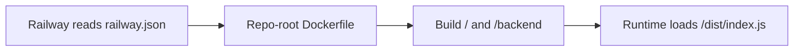

# Railway Deployment Timeline

This shows why a Railway deploy rebuilds both the repository root and `backend/`.

## What This Means

- `railway.json` tells Railway to build from the repo-root `Dockerfile`.
- The `Dockerfile` runs `npm run build` in the root stage and again in the `backend` stage.
- `backend/src/services/marketsService.ts` imports the root artifact from `dist/index.js`.

So when `src/index.ts` changes, a Railway redeploy rebuilds the root output and the backend output together.
