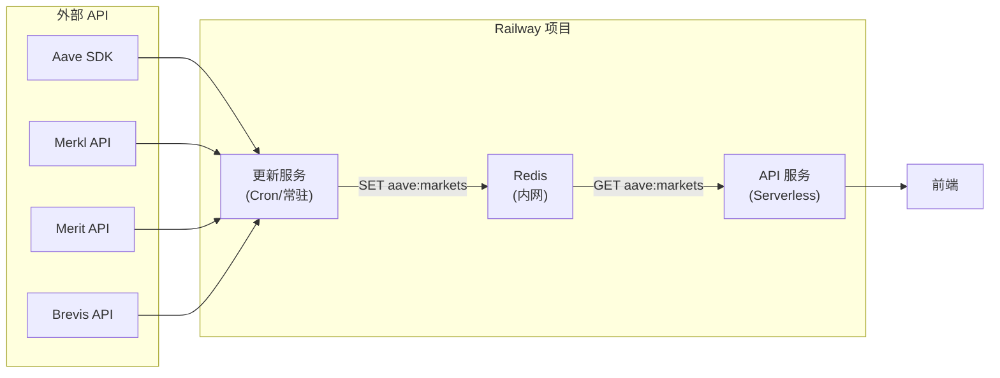

# Railway 三服务架构方案（API + 更新服务 + Redis）

本文档描述将后端拆分为三个 Railway 服务的架构方案，以支持 API 服务的 Serverless（App Sleeping）模式，同时保证数据新鲜度。

## 背景与动机

当前单服务架构存在以下挑战：

1. **Serverless 缓存丢失**：API 开启 App Sleeping 后，休眠时进程退出，内存缓存（markets、CoinGecko、Merkl 等）全部清空；唤醒后首请求需重新拉取所有数据，延迟高。
2. **node-cron 不可靠**：后端代码里的 `node-cron` 定时任务依赖进程常驻，Serverless 模式下进程不在就不会执行。
3. **Railway Cron 限制**：Railway 平台的 Cron 是「按点启动服务执行 start 命令并退出」，不是「定时发 HTTP 请求」，不适合长驻 Web 服务；且最小间隔为 5 分钟。

## 架构概览

```
┌─────────────────────────────────────────────────────────────────────┐
│                         Railway 项目                                 │
├─────────────────────────────────────────────────────────────────────┤
│                                                                      │
│   ┌──────────────────┐      写入      ┌───────────────┐             │
│   │   更新服务        │ ─────────────▶ │     Redis     │             │
│   │  (Worker/Cron)   │               │   (内网访问)   │             │
│   │  Root: /         │               │               │             │
│   └──────────────────┘               └───────┬───────┘             │
│                                              │                      │
│                                              │ 读取                  │
│                                              ▼                      │
│                                      ┌──────────────────┐          │
│                                      │    API 服务       │          │
│                                      │  (可 Serverless)  │          │
│                                      │  Root: /backend   │          │
│                                      └──────────────────┘          │
│                                              │                      │
│                                              │ HTTP                 │
│                                              ▼                      │
│                                         前端 / 客户端               │
│                                                                      │
└─────────────────────────────────────────────────────────────────────┘
```

## 三个服务的职责

| 服务 | 类型 | Root Directory | 职责 | 运行模式 |
|------|------|----------------|------|----------|
| **Redis** | 模板服务 | — | 存储 markets 数据（可扩展存 CoinGecko、Merkl 结果） | 常驻 |
| **更新服务** | 应用服务 | `/`（仓库根） | 定时拉取 Aave/Merkl/Merit/Brevis 数据，写入 Redis | Railway Cron（每 5 分钟）或常驻 + node-cron |
| **API 服务** | 应用服务 | `/backend` | 对外 HTTP 接口，从 Redis 读数据，可开 App Sleeping | 可 Serverless |

## 数据流



## 代码改动清单

### 1. 更新服务（写 Redis）

**文件**：`src/index.ts`（或新建 `scripts/fetch-and-push-redis.ts`）

**改动**：在 `runMarketsFetcher()` 完成后，若存在 `REDIS_URL`，将数据写入 Redis：

```typescript
import Redis from 'ioredis';

// 在 runMarketsFetcher() 最后
const redisUrl = process.env.REDIS_PRIVATE_URL || process.env.REDIS_URL;
if (redisUrl) {
  const redis = new Redis(redisUrl);
  const payload = JSON.stringify({
    _metadata: { timestamp: new Date().toISOString() },
    data: formattedData,
    tokenPrices,
  });
  await redis.set('aave:markets', payload);
  await redis.quit();
  logger.info('✅ Markets data written to Redis');
}
```

**依赖**：在根目录 `package.json` 添加 `ioredis`。

### 2. API 服务（读 Redis）

**文件**：`backend/src/services/marketsService.ts`

**改动**：`refreshMarketsSnapshot()` 优先从 Redis 读取，失败或无配置时回退到内部 fetcher：

```typescript
import Redis from 'ioredis';

export async function refreshMarketsSnapshot(): Promise<MarketsSnapshot> {
  const redisUrl = process.env.REDIS_PRIVATE_URL || process.env.REDIS_URL;
  
  // 优先 Redis（Serverless 场景）
  if (redisUrl) {
    try {
      const redis = new Redis(redisUrl);
      const raw = await redis.get('aave:markets');
      await redis.quit();
      
      if (raw) {
        const payload = JSON.parse(raw) as MarketsPayload;
        snapshot = { payload, fetchedAt: Date.now() };
        return snapshot;
      }
    } catch (error) {
      logger.warn('Failed to load from Redis, falling back to fetcher:', error);
    }
  }
  
  // 回退到内部 fetcher（本地开发或 Redis 不可用）
  const payload = await fetchMarketsData();
  snapshot = { payload, fetchedAt: Date.now() };
  return snapshot;
}
```

**依赖**：在 `backend/package.json` 添加 `ioredis`。

### 3. 可选：CoinGecko / Merkl Forecast 也存 Redis

若希望 API Serverless 唤醒后也有这两块的「最新缓存」，可在更新服务里同时拉取并写入 Redis：

```typescript
// 更新服务额外写入
await redis.set('aave:coingecko-categories', JSON.stringify(coingeckoData));
await redis.set('aave:coingecko-fdv', JSON.stringify(fdvData));
```

API 侧 `coingeckoController` 和 `merklForecastService` 改为优先从 Redis 读取。

**注意**：这是可选优化，不是三服务方案的前置条件。保持现状（内存缓存 + 按需请求外部 API）也可工作，只是 Serverless 唤醒后首请求会重新拉外部 API。

## Railway 配置步骤

### 1. 添加 Redis 服务

1. 在 Railway Dashboard 进入项目
2. 点击 **+ New** → **Database** → **Redis**
3. 等待部署完成，Redis 会自动生成 `REDIS_PRIVATE_URL` 等变量

### 2. 配置更新服务

1. 点击 **+ New** → **Service** → 选择你的 GitHub Repo
2. 配置：
   - **Root Directory**：留空（即 `/`，使用仓库根目录）
   - **Build Command**：`npm install && npm run build`
   - **Start Command**：`node dist/index.js`
3. 添加 Variables：
   - 引用 Redis 的 `REDIS_PRIVATE_URL`
   - 其他需要的环境变量（如 `COINMARKETCAP_API_KEY` 等）
4. **运行模式选择**：
   - **方案 A（Railway Cron）**：在 Settings → Cron Schedule 填 `*/5 * * * *`（每 5 分钟），服务执行完后退出
   - **方案 B（常驻）**：不配 Cron，服务内部用 node-cron 每分钟执行

### 3. 配置 API 服务

1. 点击 **+ New** → **Service** → 选择同一个 GitHub Repo
2. 配置：
   - **Root Directory**：`backend`
   - **Build Command**：`npm install && npm run build`
   - **Start Command**：`npm start`
3. 添加 Variables：
   - 引用 Redis 的 `REDIS_PRIVATE_URL`
   - `PORT`、`NODE_ENV`、`FRONTEND_URL` 等
4. 可选：开启 **App Sleeping**（Settings → Enable App Sleeping）

### 4. 变量引用示例

在 API 服务和更新服务的 Variables 中：

```
REDIS_PRIVATE_URL = ${{Redis.REDIS_PRIVATE_URL}}
```

Railway 会在部署时将 Redis 服务的内网地址注入。

## Redis 内网访问

- **推荐**：使用 `REDIS_PRIVATE_URL`（内网地址），流量不出 Railway，更快更安全
- **可选**：在 Redis 服务 Settings 里关闭 Public Networking，完全禁止外部访问
- **代码中**：优先读 `REDIS_PRIVATE_URL`，回退 `REDIS_URL`

```typescript
const redisUrl = process.env.REDIS_PRIVATE_URL || process.env.REDIS_URL;
```

## 费用考量

| 服务 | 计费方式 | 优化建议 |
|------|----------|----------|
| **Redis** | 按内存/连接数 | 选择合适的 plan；数据量小时费用很低 |
| **更新服务** | Railway Cron 模式只算执行时间 | 用 Cron 比常驻便宜很多（每 5 分钟跑 1-2 分钟 vs 24h 常驻） |
| **API 服务** | 可开 App Sleeping | 无请求时不计费；有请求才唤醒 |

**对比单服务**：三服务总价通常略高，但通过 Cron + Sleeping 组合，总成本仍可控制在合理范围。

## In-flight 合并说明

**问：多个并发请求会打爆外部 API 吗？**

不会。代码里已有 in-flight 合并机制：

- 同一类请求（如同一个 `campaignId` 的 forecast）只发**一次**外部请求
- 后续并发请求等待同一个 Promise，复用结果
- 合并的「时间范围」= 这一轮外部请求的耗时（不是固定时间窗口）

这个机制在三服务架构下仍然有效（对 API 里还保留的 CoinGecko/Merkl 请求有效）。

## Serverless 与缓存

| 缓存类型 | Serverless 休眠后 | 三服务方案下 |
|----------|-------------------|--------------|
| **markets 数据** | 内存丢失 | 从 Redis 读，唤醒后立刻可用 |
| **CoinGecko** | 内存丢失 | 保持内存缓存（可选存 Redis） |
| **Merkl forecast** | 内存丢失 | 保持内存缓存（可选存 Redis） |

唤醒后 `loadData()` 从 Redis 读取 markets 数据，只做 JSON parse，不调外部 API，首请求延迟可控（毫秒级）。

## 迁移步骤

1. **代码改动**（可先在本地测试）
   - 根目录添加 `ioredis` 依赖
   - `src/index.ts` 添加写 Redis 逻辑（有 `REDIS_URL` 才写）
   - `backend` 添加 `ioredis` 依赖
   - `marketsService.ts` 添加从 Redis 读的逻辑（优先 Redis，回退 fetcher）

2. **本地测试**
   - 不设 `REDIS_URL`：代码走文件路径，和现在一样
   - 设 `REDIS_URL` 指向本地 Redis：验证读写正常

3. **Railway 部署**
   - 在 Railway 项目里添加 Redis 服务
   - 添加更新服务（配置 Root = `/`，引用 Redis 变量）
   - 添加 API 服务（配置 Root = `/backend`，引用 Redis 变量）
   - 配置更新服务的 Cron 或常驻模式
   - 可选：开启 API 服务的 App Sleeping

4. **验证**
   - 检查更新服务日志：看到 `✅ Markets data written to Redis`
   - 检查 API 服务日志：看到 `✅ Data loaded from Redis`
   - 测试 API 响应正常

## 附录：一个 Repo 多个 Root Directory

Railway 支持同一个 Repo 的不同服务使用不同的 Root Directory：

- **API 服务**：Root = `backend` → 使用 `backend/package.json`
- **更新服务**：Root = `` 或 `/` → 使用根目录 `package.json`

这是 Railway 的标准做法，不需要维护两个 Repo。

## 相关文档

- [deploy.md](./deploy.md) - 后端部署指南（单服务模式）
- [data-freshness-mechanism.md](../backend/data-freshness-mechanism.md) - 数据新鲜度机制
- [merkl-merit-cache-architecture.md](../merkl-merit-cache-architecture.md) - Merkl/Merit 缓存架构
