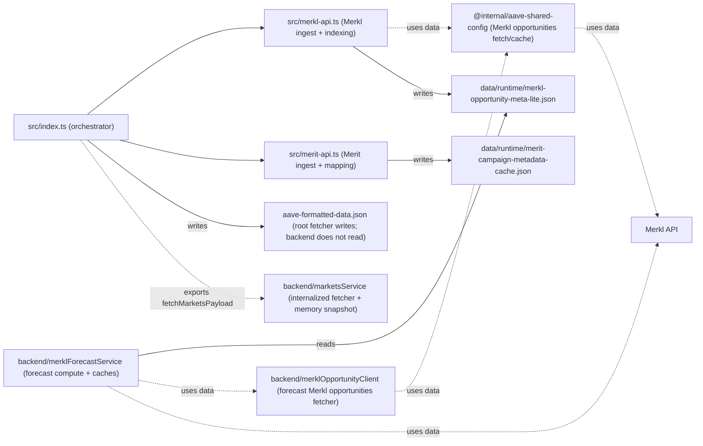
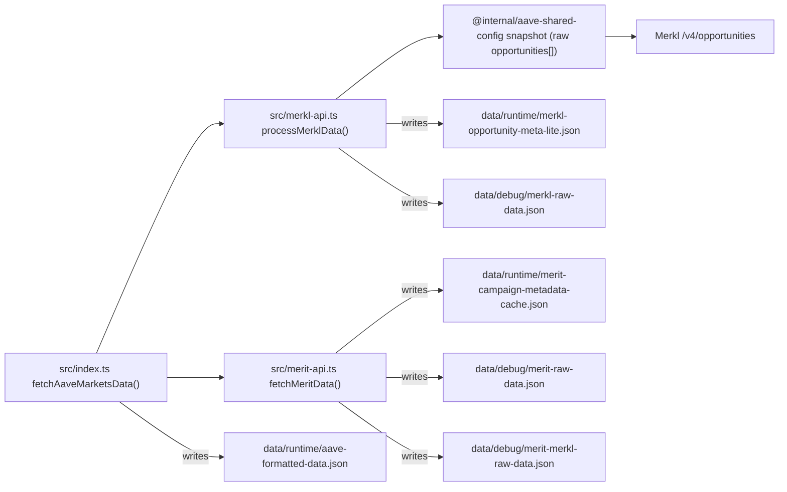
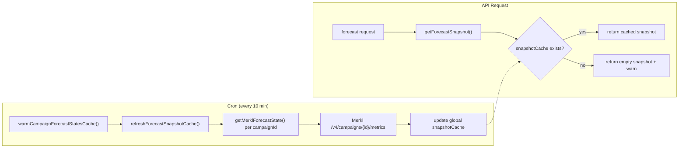
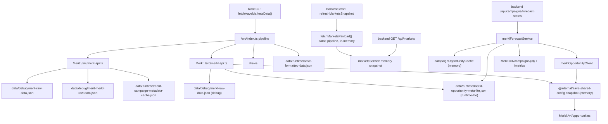
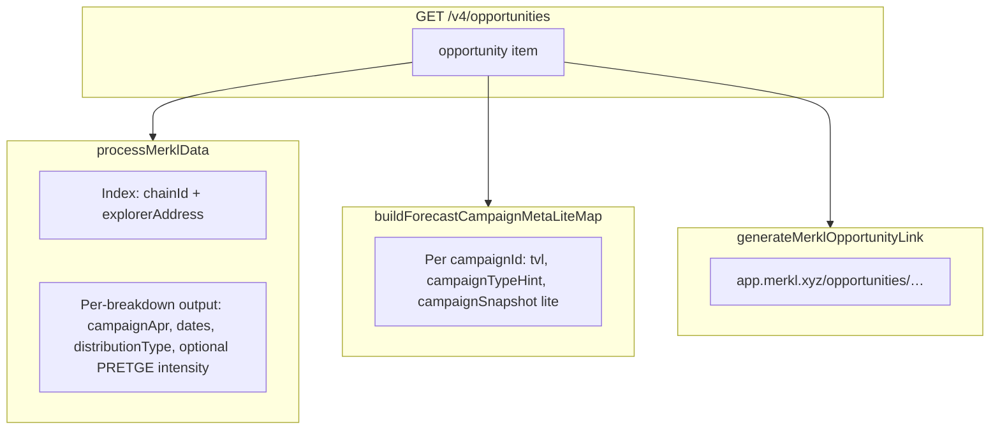
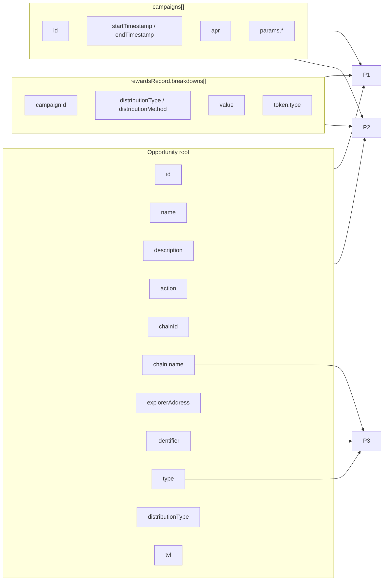
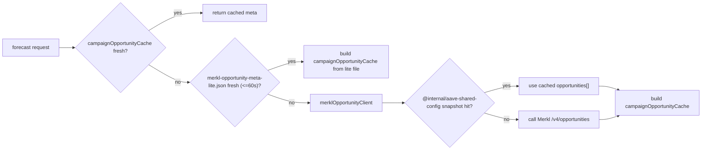

# Merkl / Merit Data Flow & Cache Architecture

Last updated: 2026-03-25 (field map expanded)

This document explains how Merkl + Merit data moves through the codebase, which files are for debugging vs runtime, and which caches are in memory.

## 0) Two Key Flows (Most Practical View)

### Arrow semantics (for the diagrams below)

- `-->` = function call / control flow
- `-- "reads" -->` = reads from file/cache
- `-- "writes" -->` = persists to disk
- `-. "fallback" .->` = fallback path only
- `-. "uses data" .->` = data dependency (not ownership/creation)

### C) Component responsibility / dependency view (no request timing)



### A) Producer flow (root fetcher writes runtime/debug files)



### B) Forecast data path (`/api/campaigns/forecast-states`)

**Cron-write, API-read-only pattern** (changed 2026-03-14):



**Key change**: API requests **never** call Merkl API. They only read from the global snapshot cache populated by cron.

**Field lineage** (which values come straight from Merkl vs computed in `merklForecastService` / `merklForecastModel`): see `docs/api/api-documentation.md` → **Merkl Forecast：上游数据与派生字段**.

## 1) Big Picture (Backend)



## 2) File Responsibilities (Disk)

### Runtime-facing (program reads)
- `data/runtime/aave-formatted-data.json`
  - Written when the **root** fetcher runs (`fetchAaveMarketsData` / CLI); not read by `GET /api/markets`. The backend serves markets from `marketsService` memory via `fetchMarketsPayload()` (same pipeline, no file read on the request path).
- `data/runtime/merkl-opportunity-meta-lite.json`
  - Forecast service preferred file source (campaign-level lightweight meta)
- `data/runtime/merit-campaign-metadata-cache.json`
  - Merit campaign metadata cache (time ranges/message/link) for `fetchMeritData()`

### Debug / Troubleshoot (human-facing first)
- `data/debug/merkl-raw-data.json`
  - Full Merkl debug snapshot (raw/live opportunities + processed/index)
- `data/debug/merit-raw-data.json`
  - Merit APR raw + campaignMetadataByKey + built index
- `data/debug/merit-merkl-raw-data.json`
  - Merit last-round reward estimation debug (Merkl JSON_AIRDROP history scan)
- `data/debug/brevis-raw-data.json`
  - Brevis debug snapshot

### Merkl → `/api/markets` reserve fields: `dailyPoints` / `pointsPerThousandUsd`

Implemented in `src/merkl-api.ts` (`merklBreakdownUsesPointsIntensityFields` + `merklPointsFieldsFromBreakdownValue`). Emitted **only** when `rewardsRecord.breakdowns[].token.type === 'PRETGE'` (Merkl pre-TGE reward token). Other tokens, protocols, or opportunity names are not special-cased; consumers use `campaignApr` and the rest of the breakdown for normal TOKEN rewards.

Optional script `scripts/merkl-pretge-points-overlap.mjs` compares PRETGE rows vs symbol/name containing the word `points` on a debug snapshot (historically identical sets; re-run if Merkl’s schema changes).

### Merkl `/v4/opportunities[]` item: which fields `merkl-api.ts` reads

Source: `src/merkl-api.ts` (markets merge + forecast-lite enrichment + link building). Types in code list extra fields (e.g. `protocol`, `tokens[]`); **those are not used in current pipeline logic** unless noted below.

#### Diagram — three pipelines from one opportunity row



#### Diagram — field groups → sinks



#### Table — opportunity root

| Field | Role in this repo |
|-------|-------------------|
| `id` | Diagnostics / logs when skipping or warning |
| `name` | Ethereum-only market guess via `parseMarketNameFromOpportunityName`; copied to output group as `name` |
| `description` | Copied to output as `description` when present |
| `action` | Routes breakdowns to `supply` / `borrow` / `hold` (`LEND` / `BORROW` / `HOLD`) |
| `chainId` | Index key segment; whether to parse market name (only `1` uses name-based market) |
| `chain.name` | Required for Merkl opportunity URL (lowercased) |
| `explorerAddress` | Index key (lowercased); must exist or opportunity is skipped |
| `identifier` | Merkl opportunity URL path segment |
| `type` | Merkl opportunity URL path segment (e.g. `AAVE_NET_LENDING`) |
| `distributionType` | Fallback when a breakdown omits its own distribution type/method; also feeds forecast type normalization when breakdown-level string is missing |
| `tvl` | Opportunity TVL for `pointsPerThousandUsd`; forecast meta `latestTvl`; intensity log line |

#### Table — `rewardsRecord.breakdowns[]`

| Field | Role |
|-------|------|
| `campaignId` | Join key to embedded `campaigns[]` and to optional `GET /v4/campaigns/{id}`; forecast map key |
| `distributionType` / `distributionMethod` | Output `distributionType`; raw input to `normalizeForecastCampaignTypeLite` (with opportunity fallbacks) |
| `value` | With `tvl`, drives `dailyPoints` / `pointsPerThousandUsd` **only if** `token.type === 'PRETGE'` |
| `token.type` | Must be `PRETGE` to emit intensity fields; other token fields are not read for markets output |

#### Table — embedded `campaigns[]` (per campaign object)

| Field | Role |
|-------|------|
| `id` | Must match `rewardsRecord.breakdowns[].campaignId` for cache lookup |
| `startTimestamp` / `endTimestamp` | Converted to ISO strings on each output breakdown |
| `apr` | Output as `campaignApr` |
| `params` | `isCampaignWhitelistOnly` reads `params.whitelist` and nested `composedCampaigns[].campaignParameters.whitelist`; forecast lite snapshot also reads `params.decimalsRewardToken` and `params.distributionMethodParameters.distributionSettings.apr` when building `campaignSnapshot` |

#### Forecast lite snapshot (from embedded campaign), used for `buildForecastFieldsFromOpportunity`

Additional fields read **only** inside `buildCampaignSnapshotLiteForForecastFile` for matching `campaignId`: `amount`, `rewardToken.price`, `rewardToken.decimals`, plus `params` branches above. If a breakdown’s `campaignId` has no embedded campaign object, the code may **fetch** `GET /v4/campaigns/{campaignId}` to fill the same `MerklCampaignDetails` used for markets breakdowns (dates, APR, whitelist) — that response is **not** part of the opportunities array; document it as a sibling API.

#### Not used by current `merkl-api` logic

`protocol`, `tokens[]`, `status` on the opportunity (may appear in JSON; pipeline ignores them for computation).

## 3) In-Memory Caches (Runtime)

### A) `marketsService` snapshot (`backend/src/services/marketsService.ts`)
- Internalized data fetcher with in-memory snapshot
- Cron-write/API-read-only pattern (cron every 1 minute)
- Uses `fetchMarketsPayload()` from `dist/index.js` (root fetcher)

### B) `campaignOpportunityCache` (`backend/src/services/merklForecastService.ts`)
- Forecast-only campaign meta index:
  - `campaignId -> { tvl, campaignTypeHint, campaignSnapshot }`
- Rebuilt on demand when expired
- TTL (current): 5 minutes (default), configurable independently from forecast result cache

### C) `snapshotCache` (`backend/src/controllers/merklForecastController.ts`)
- **Global snapshot cache** for all forecast states (cron-write, API-read-only pattern)
- Populated by `warmCampaignForecastStatesCache()` (cron every 10 min + server startup)
- API requests **only read** from this cache; they never trigger Merkl API calls
- TTL: effectively 10 minutes (controlled by cron interval)

Example shape:
```ts
{
  snapshot: {
    items: ForecastResponseItem[];
    errors: Array<{ campaignId: string; message: string }>;
    staleTimeMs: number;
  };
  generatedAt: number;
}
```

### D) `metricsCache` (`backend/src/services/merklForecastService.ts`)
- Per-campaign cache for **forecast-trimmed** Merkl `/metrics` data (`dailyRewardsRecords`, `tvlRecords` latest-only)
- **Each `campaignId` has its own TTL** (cadence inferred from that campaign’s `dailyRewardsRecords` only), so **metrics refetch intervals can differ across campaigns**; see `docs/backend/data-freshness-mechanism.md` → Merkl Metrics 动态 TTL
- TTL is derived from observed metrics record cadence (with default/min/max bounds)
- **This is the key optimization** - metrics API calls are expensive; forecast computation is fast
- Cadence inference uses `dailyRewardsRecords` timestamps (same series used for `distributedSoFar` integration)
- Current defaults:
  - default TTL: 30m
  - empty-record TTL: 10m (aligned with clamp min)
  - dynamic TTL clamp: 10m .. 6h

**Note**: `forecastCache` was removed because with cron-write pattern (every 10m), it provided no benefit.
The forecast computation is fast; the `metricsCache` with dynamic TTL is what actually saves API calls.

### E) `@internal/aave-shared-config` snapshot cache (`packages/aave-shared-config`)
- Caches **raw Merkl opportunities array** (not forecast-lite)
- Keyed by query params (`mainProtocolId/status/campaigns/itemsPerPage/...`)
- Used by root Merkl fetcher (`src/merkl-api.ts`) and backend forecast fallback (`backend/src/services/merklOpportunityClient.ts`)

Example shape:
```ts
Map<string, {
  data: unknown[];          // opportunities[]
  expiresAt: number;
  inFlight?: Promise<unknown[]>;
}>
```

### F) `meritRoundEstimateCache` (`src/merit-api.ts`)
- Per-key cache for Merit last-round reward estimates from Merkl JSON_AIRDROP history
- Key format: `${chainId}:${action}:${token}` (e.g. `42220:supply:usdt`)
- Current policy: check each key at most once per 24h

## 4) Merit: Why `loadCachedTimeRanges()` Exists

`fetchMeritData()` needs `timeRanges` because they carry:
- Merkl/Merit campaign link
- `startDate` / `endDate`
- `startBlock` / `endBlock` (fallback end-state signal)
- campaign `name`
- `message` (including self-auth hints)

Without cached `timeRanges`, the code would re-crawl campaign pages on every refresh.  
Now it uses a module-level in-memory cache first (process lifetime), then reads `data/runtime/merit-campaign-metadata-cache.json`, then falls back to `data/debug/merit-raw-data.json` for compatibility.
This cache is intentionally event-driven (new key / refetch path / process restart) rather than TTL-driven.

## 5) Refresh Cadence vs Freshness (Important Pattern)

Two different concepts:

- **Write frequency (production frequency)** = how often a producer writes a file/snapshot
- **Freshness window (consumer tolerance)** = how old data can be before consumer rejects it

Example in current code:
- `merkl-opportunity-meta-lite.json` is written when root data refresh runs (often ~1m cadence)
- Forecast service accepts it if file timestamp is within **5 minutes**

This decoupling makes the system tolerant to scheduler jitter and temporary delays.

## 6) Merit JSON_AIRDROP “Last Round” Check (Per-key 24h)

`fetchMeritRoundEstimates()` does **not** run as a standalone cron.  
It is called during `fetchMeritData()`, and then:
- builds target keys from current merit APR keys
- checks each key’s `lastCheckedAtMs`
- if any key is due, runs one Merkl history scan and stamps all current target keys together (`lastCheckedAtMs`)
- applies a short global scan cooldown (request coalescing / anti-stampede)

Notes:
- `lastCheckedAtMs` = **when we checked**, not “when data changed”
- Negative cache is used for misses (`estimate = null`), so keys that were checked but not found still record `lastCheckedAtMs`
- Key set can change across runs (new Merit incentives added, old ones removed)
- Do **not** trust `order=desc` on Merkl `PAST + JSON_AIRDROP` opportunities as “latest round first”
  - empirical behavior can surface older rounds (e.g. round 4) before newer rounds (e.g. round 18)
  - matcher must compare campaign timestamps and select the newest hit per key
  - debug snapshot should record `pagesScanned` to track scan cost and optimization impact
- When targets are known, scan `PAST + JSON_AIRDROP` **per target chainId** (Merit key prefix) to reduce irrelevant pages.
  - still compare timestamps (no reliance on upstream ordering)
  - record `pagesScannedByChain` in debug snapshot for optimization visibility
- Use `creatorSlug=aave` for Merit round scans (empirically narrows pages while still matching current Aave/Merit JSON_AIRDROP rounds).
- `campaignId` query on `/v4/opportunities` is not a reliable replacement for matching nested campaign IDs in this flow (can return empty even when the target campaign exists inside an opportunity payload).
- If `hitCacheOnly=true`, no Merkl history scan was executed in that run (`pagesScanned` can be `0`); clear/bypass cache before evaluating scan-query changes.

## 7) Current Forecast Fallback Order (After recent refactor)



(`merkl-raw-data.json` fallback for forecast has been removed.)

## 8) Terminology

- **Persist to disk / 落盘**: write a JSON snapshot file to disk
- **Snapshot**: point-in-time cached data copy
- **Index (runtime index)**: compact structure optimized for lookups (e.g. `campaignId -> meta`)
- **Raw / debug snapshot**: larger multi-purpose JSON for troubleshooting or audits

## 9) Recommended Next Steps (Planned / Optional)

1. Keep `merkl-raw-data.json` as debug-first file; no urgent slimming required now that runtime prefers lite file.
2. Optionally prewarm forecast caches at backend startup or scheduler tick to reduce first-request latency.
3. If moving to multi-replica, promote shared cache/storage (e.g. Redis) before treating local files as the primary runtime source.
