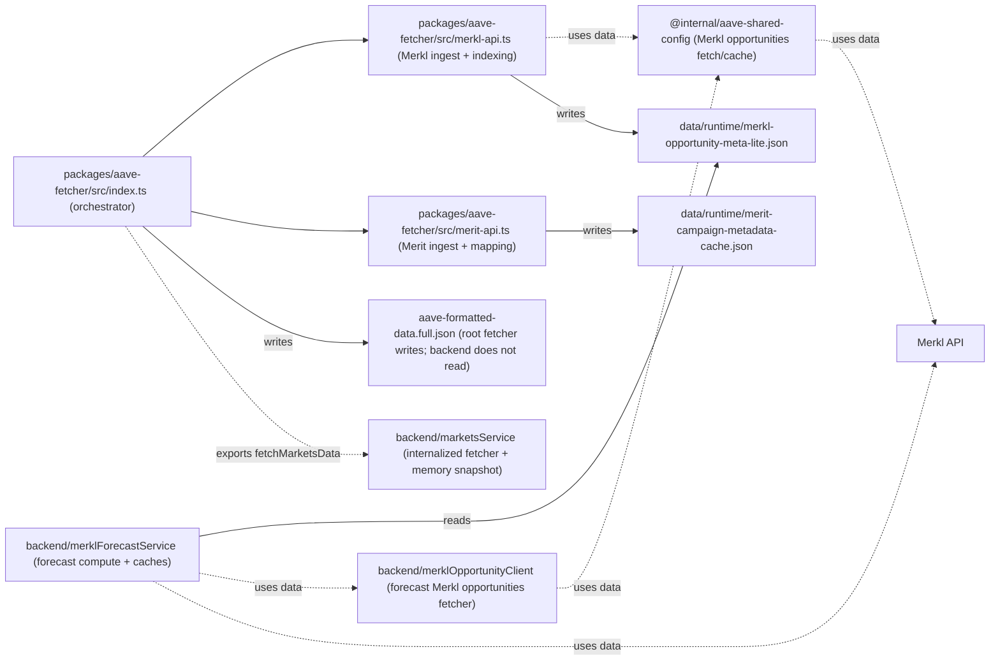
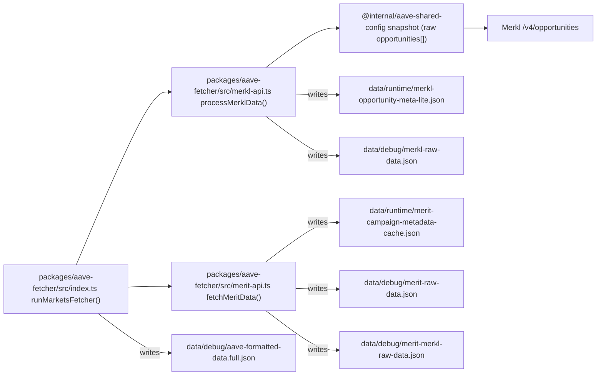
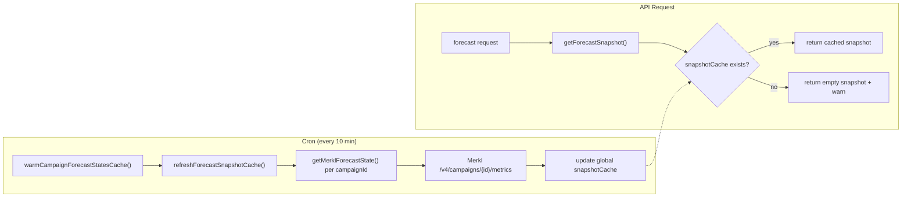
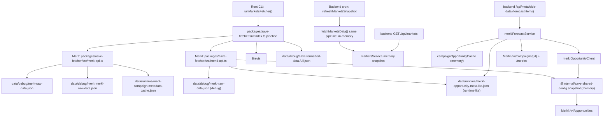
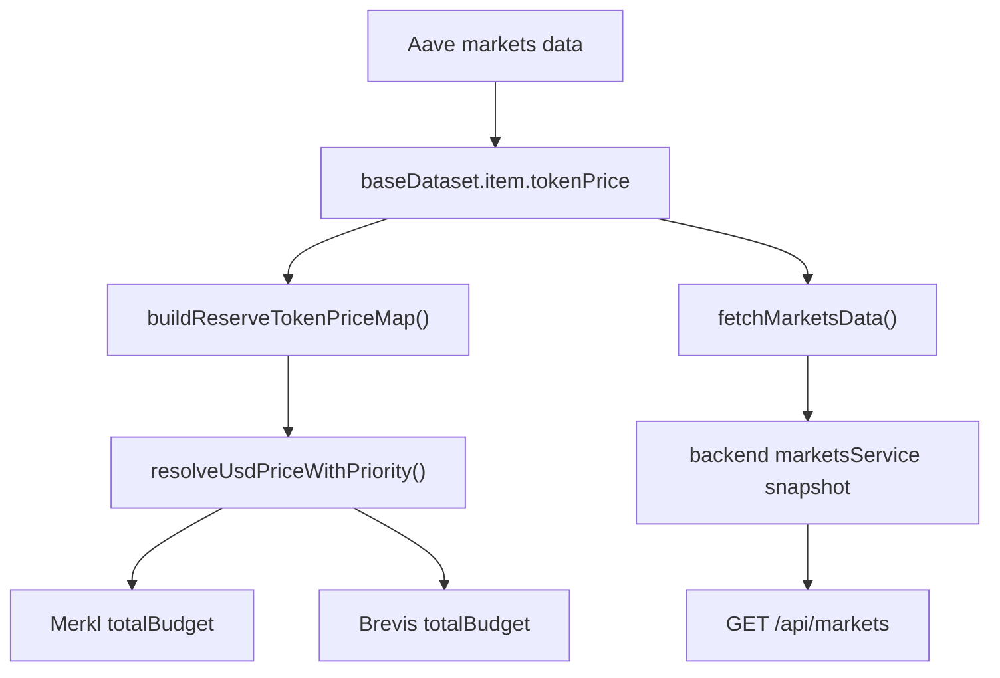

# Merkl / Merit Data Flow & Cache Architecture

Last updated: 2026-04-09 (compressed overview)

This document explains how Merkl + Merit data moves through the codebase, which files are for debugging vs runtime, and which caches are in memory.

## 0) Cache Taxonomy

One data set can pass through more than one layer. The terms below describe the role, not just the implementation.

| Type | What it is | Scope | Writes | Reads | Example |
|---|---|---|---|---|---|
| Pure in-memory cache | Small keyed cache for repeated sub-results | One process | Lazy/on demand | Same process only | `metricsCache`, `tokenPriceResolveCache` |
| In-memory snapshot | Whole assembled state ready to serve | One process | Cron/startup refresh | API reads only | `snapshotCache`, `marketsService.snapshot` |
| Runtime bridge file | Compact file used to hand off data across processes or restarts | Disk + runtime | Root writer | Backend/root fallback | `data/runtime/merkl-opportunity-meta-lite.json` |
| Debug file | Verbose troubleshooting artifact | Disk + debug | Root writer | Humans/scripts | `data/debug/merkl-raw-data.json` |

## 1) Two Key Flows (Most Practical View)

### Arrow semantics (for the diagrams below)

- `-->` = function call / control flow
- `-- "reads" -->` = reads from file/cache
- `-- "writes" -->` = persists to disk
- `-. "fallback" .->` = fallback path only
- `-. "uses data" .->` = data dependency (not ownership/creation)

### C) Component responsibility / dependency view (no request timing)

### A) Producer flow (root fetcher writes runtime/debug files)

### B) Forecast data path（公开入口：`/api/meta/side-data` → `forecast.items`）

**Cron-write, API-read-only pattern** (changed 2026-03-14):

**Key change**: API requests **never** call Merkl API. They only read from the global snapshot cache populated by cron.

**Field lineage** (which values come straight from Merkl vs computed in `merklForecastService` / `merklForecastModel`): see `docs/api/api-documentation.md` → **Merkl Forecast：上游数据与派生字段**.

## 2) Big Picture (Backend)

## 3) File Responsibilities (Disk)

### Runtime-facing (program reads)
- `data/runtime/merkl-opportunity-meta-lite.json`
  - Forecast service preferred file source (campaign-level lightweight meta)
- `data/runtime/merit-campaign-metadata-cache.json`
  - Merit campaign metadata cache (time ranges/message/link) for `fetchMeritData()`

### Debug / Troubleshoot (human-facing first)
- `data/debug/aave-formatted-data.full.json`
  - Written when the **root** fetcher runs (`runMarketsFetcher` / CLI); not read by `GET /api/markets`. The backend serves markets from `marketsService` memory via `fetchMarketsData()` (same pipeline, no file read on the request path).
- `data/debug/merkl-raw-data.json`
  - Full Merkl debug snapshot (raw/live opportunities + processed/index)
- `data/debug/merit-raw-data.json`
  - Merit APR raw + campaignMetadataByKey + built index
- `data/debug/merit-merkl-raw-data.json`
  - Merit last-round reward estimation debug (Merkl JSON_AIRDROP history scan)
- `data/debug/brevis-raw-data.json`
  - Brevis debug snapshot

### Merkl / Merit focused caches

- `marketsService.snapshot`: in-memory markets snapshot, read by `GET /api/markets`
- `campaignOpportunityCache`: per-forecast campaign meta index, rebuilt on demand
- `snapshotCache`: cron-written forecast response snapshot for `GET /api/meta/side-data`
- `metricsCache`: per-campaign Merkl metrics cache, dynamic TTL by cadence
- `@internal/aave-shared-config` snapshot cache: shared raw opportunities cache for root/backend fallback
- `meritRoundEstimateCache`: per-key Merit history estimate cache
- `meritCampaignMetadataMemoryCache` + `data/runtime/merit-campaign-metadata-cache.json`: in-memory + runtime bridge for Merit metadata

### Other runtime caches

- `tokenPriceResolveCache`: short-lived token price memoization
- `coingeckoPlatformCache`: CoinGecko platform-id lookup cache

### Token price lineage

`tokenPriceResolveCache` only memoizes price lookups inside the root pipeline; it does not replace the Aave-sourced `reserve.tokenPrice` that is later exposed through `GET /api/markets`.

### How the layers relate

1. Root fetcher may write a runtime bridge file.
2. Backend may read that file once and turn it into an in-memory cache.
3. API endpoints usually read only the in-memory snapshot/cache.
4. Expensive sub-requests use per-key in-memory caches.

### Why the split exists

- In-memory cache: avoids repeated work inside one process
- In-memory snapshot: serves a complete response without recomputing it
- Runtime bridge file: survives restart and enables root/backend handoff

### Fileability status

| Status | Meaning | Examples |
|---|---|---|
| 已文件化 | 现在已经依赖 runtime file / disk artifact | `data/runtime/merkl-opportunity-meta-lite.json`, `data/runtime/merit-campaign-metadata-cache.json` |
| 适合文件化但未实现 | 重启后希望保留上次可用结果，且结果天然是整块快照 | `GET /api/markets` full snapshot, `GET /api/meta/side-data` forecast snapshot |
| 不适合文件化 | 细粒度、短生命周期、或重建成本很低 | `metricsCache`, `tokenPriceResolveCache`, `coingeckoPlatformCache` |

Rules of thumb:

1. If restart recovery matters, runtime file or external storage is required.
2. If the data is keyed and hot-path only, keep it in memory.
3. If the data is an assembled response, file it only when restart recovery is worth the extra complexity.

### What is documented elsewhere

- Field-level Merkl mapping: `docs/api/api-documentation.md`
- TTL and freshness policy: `docs/backend/data-freshness-mechanism.md`
- Reusable cache patterns: `docs/reusable/caching-data-freshness-patterns.md`

## 4) Terminology

- **Persist to disk / 落盘**: write a JSON snapshot file to disk
- **Snapshot**: point-in-time cached data copy
- **Index (runtime index)**: compact structure optimized for lookups (e.g. `campaignId -> meta`)
- **Raw / debug snapshot**: larger multi-purpose JSON for troubleshooting or audits

## 5) Recommended Next Steps (Planned / Optional)

1. Keep `merkl-raw-data.json` as debug-first file; no urgent slimming required now that runtime prefers lite file.
2. Optionally prewarm forecast caches at backend startup or scheduler tick to reduce first-request latency.
3. If moving to multi-replica, promote shared cache/storage (e.g. Redis) before treating local files as the primary runtime source.
