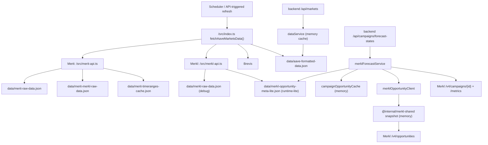
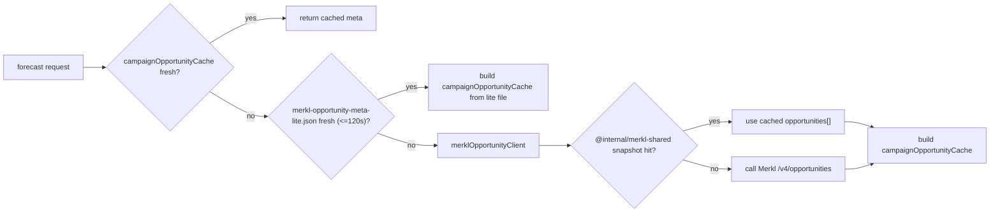

# Merkl / Merit Data Flow & Cache Architecture

Last updated: 2026-02-24

This document explains how Merkl + Merit data moves through the codebase, which files are for debugging vs runtime, and which caches are in memory.

## 1) Big Picture (Backend)



## 2) File Responsibilities (Disk)

### Runtime-facing (program reads)
- `data/aave-formatted-data.json`
  - Main `/api/markets` source (via `dataService`)
- `data/merkl-opportunity-meta-lite.json`
  - Forecast service preferred file source (campaign-level lightweight meta)
- `data/merit-timeranges-cache.json`
  - Merit timeRanges/message cache for `fetchMeritData()`

### Debug / Troubleshoot (human-facing first)
- `data/merkl-raw-data.json`
  - Full Merkl debug snapshot (raw/live opportunities + processed/index/tokenPrices)
- `data/merit-raw-data.json`
  - Merit APR raw + timeRanges + built index
- `data/merit-merkl-raw-data.json`
  - Merit last-round reward estimation debug (Merkl JSON_AIRDROP history scan)
- `data/brevis-raw-data.json`
  - Brevis debug snapshot

## 3) In-Memory Caches (Runtime)

### A) `dataService` cache (`backend/src/services/dataService.ts`)
- Caches parsed `aave-formatted-data.json` for `/api/markets`
- Stale threshold (current): 60s

### B) `campaignOpportunityCache` (`backend/src/services/merklForecastService.ts`)
- Forecast-only campaign meta index:
  - `campaignId -> { tvl, campaignTypeHint, distributionTypeRaw, campaignSnapshot }`
- Rebuilt on demand when expired
- TTL (current): uses forecast cache TTL config path (typically 60s)

### C) `forecastCache` (`backend/src/services/merklForecastService.ts`)
- Final forecast state cache by campaignId
- Stores computed result returned by `/api/campaigns/forecast-states`

Example shape:
```ts
Map<string, {
  data: {
    campaignId: string;
    campaignType: 'MAX_REWARD_VALUE_PER_LIQUIDITY_VALUE' | 'DUTCH_AUCTION' | 'FIX_REWARD_VALUE_PER_LIQUIDITY_VALUE';
    plannedDaily: number;
    requiredDaily: number;
    totalBudget: number;
    distributedSoFar: number;
    latestTvl: number;
    aprCap: number | null;
    startTimestamp: number;
    endTimestamp: number;
    asOf: number;
  };
  expiresAt: number;
}>
```

### D) `@internal/merkl-shared` snapshot cache (`packages/merkl-shared`)
- Caches **raw Merkl opportunities array** (not forecast-lite)
- Keyed by query params (`mainProtocolId/status/campaigns/itemsPerPage/...`)
- Used as online fallback optimization

Example shape:
```ts
Map<string, {
  data: unknown[];          // opportunities[]
  expiresAt: number;
  inFlight?: Promise<unknown[]>;
}>
```

### E) `meritRoundEstimateCache` (`src/merit-api.ts`)
- Per-key cache for Merit last-round reward estimates from Merkl JSON_AIRDROP history
- Key format: `${chainId}:${action}:${token}` (e.g. `42220:supply:usdt`)
- Current policy: check each key at most once per 24h

## 4) Merit: Why `loadCachedTimeRanges()` Exists

`fetchMeritData()` needs `timeRanges` because they carry:
- Merkl/Merit campaign link
- `startDate` / `endDate`
- `startBlock` / `endBlock` (fallback end-state signal)
- campaign `name`
- `message` (including self-auth hints)

Without cached `timeRanges`, the code would re-crawl campaign pages on every refresh.  
Now it reads `data/merit-timeranges-cache.json` first (smaller file), then falls back to `data/merit-raw-data.json` for compatibility.

## 5) Refresh Cadence vs Freshness (Important Pattern)

Two different concepts:

- **Write frequency (production frequency)** = how often a producer writes a file/snapshot
- **Freshness window (consumer tolerance)** = how old data can be before consumer rejects it

Example in current code:
- `merkl-opportunity-meta-lite.json` is written when root data refresh runs (often ~1m cadence)
- Forecast service accepts it if file timestamp is within **120s**

This decoupling makes the system tolerant to scheduler jitter and temporary delays.

## 6) Merit JSON_AIRDROP “Last Round” Check (Per-key 24h)

`fetchMeritRoundEstimates()` does **not** run as a standalone cron.  
It is called during `fetchMeritData()`, and then:
- builds target keys from current merit APR keys
- checks each key’s `lastCheckedAtMs`
- only queries Merkl history for keys that are due

Notes:
- `lastCheckedAtMs` = **when we checked**, not “when data changed”
- New keys that never produced a cached result may not have an entry yet
- Key set can change across runs (new Merit incentives added, old ones removed)

## 7) Current Forecast Fallback Order (After recent refactor)



(`merkl-raw-data.json` fallback for forecast has been removed.)

## 8) Terminology

- **Persist to disk / 落盘**: write a JSON snapshot file to disk
- **Snapshot**: point-in-time cached data copy
- **Index (runtime index)**: compact structure optimized for lookups (e.g. `campaignId -> meta`)
- **Raw / debug snapshot**: larger multi-purpose JSON for troubleshooting or audits

## 9) Recommended Next Steps (Planned / Optional)

1. Keep `merkl-raw-data.json` as debug-first file; no urgent slimming required now that runtime prefers lite file.
2. Optionally prewarm forecast caches at backend startup or scheduler tick to reduce first-request latency.
3. If moving to multi-replica, promote shared cache/storage (e.g. Redis) before treating local files as the primary runtime source.

